# DONNE

**VICTORIA'S SECRET (Qualsiasi, anche le acque profumate)**  
*Non valuto perché qui parlo di ogni profumo VS.*  
Hai 14 anni? Immagino di no. Allora spiegami, senza iniziare la frase con "c'è", perchè odori come lo spogliatoio di una palestra femminile delle medie. Amore, sapere di "*pera e zucchero*" e avere le mutandine VS glitterate che fanno capolino dai light wash mom jeans di PULL&BEAR è un grido d'aiuto a cui nessuno (se non disperati) risponderà.

**PRADA Paradoxe**  
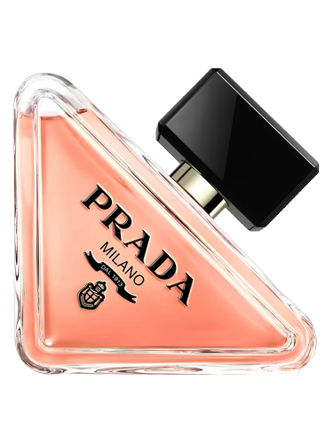  
*8/10*  
Insicura come la merda, hai tanti, ma TANTI amici falsi. Ovviamente anche tu lo sei. Una semi-diva though, non ti vesti male, ti prendi molto cura dell'estetica e in generale ci tieni molto ad apparire, che ti fa onore, visto che dentro sei una merda. Brutalmente direi anche che sei piuttosto stupida, ma chi usa questo profumo si posiziona su un pendolo che va dal tossicismo puro, meschino e fottutamente geniale alla più blanda distesa di pallida stupidità mai vista. Hai una cartella in evidenza sul profilo dove metti le tue foto e si chiama "ego" e spoiler: non sai che cazzo significa quella parola. Ascolti musica di merda (ma son gusti!). Probabilmente hai un cane piccolo, l'hai avuto, o lo vorresti.

**MUGLER Angel**  
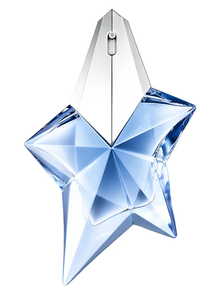  
*4/10*  
Regina della dissonanza cognitiva. Vuoi disperatamente proiettare un'immagine di te che non ti appartiene e non ti apparterrà MAI. Vuoi che la gente ti veda come una bambolina innocua, una soft girl un po' svampita che ha bisogno di essere protetta. Brava a mentire. *Da piccolina ti è successo qualcosa di brutto brutto, eh?* 
$$
\{X \in Angel \iff 50 < BodyCount(X) \leq 100\}
$$  

**YSL Libre**  
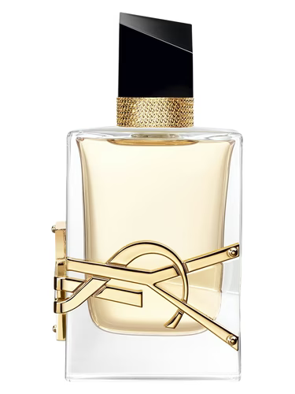  
*8/10*  
*Oh, Libre*… quante, quante cose avrei da dire.   
Se avessi SOLO l'olfatto come senso funzionante, riconoscerei i daddy issues di una ragazza in 1 secondo grazie a te. Per mainstream budget baddies. Ami le attenzioni, si vede, ma fai finta che non sia vero. Ti piace anche fingere di avere i soldi e quando trovi modo di infilarti in qualche antro che pullula di high-end people, non ti godi niente perchè sei troppo concentrata a controllare con la coda dell'occhio se qualcuno ti caga (bad news: hai degli stivaletti neri 100mm di Pittarello e un blazer di H\&M, NESSUNO tra quella gente ti cagherà).

**YSL Libre Intense / Libre Vanille Couture**  
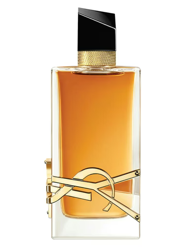
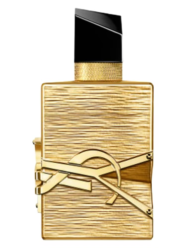  
*10/10*  
Visto che sono le mie signature, non commenterò molto, anche se ovviamente avrei da parlarne a lungo.   
In ogni caso, sei me. Il che mi dispiace *molto*.  
Li metto insieme per comodità e perchè, bene o male, condividono un pubblico di simile fama. Profumi migliori della storia btw a mani basse.  
Entrambi prediletti per ragazze con dei daddy issues fuori di testa. *Spero tu sia bionda. Non ce la vedo una mora a usarli.*   
Fanno un po' da scudo a tutto quello che potrebbe far "saltare la copertura" di quello che in realtà sei. Funziona per chi non ti vede davvero.  
Chi invece, per tua sventura, ti vede, e ti vede fino alle ossa, vede anche il cantiere di costruzione personalità, e non è un bel panorama.

**YSL Libre Le Parfum**  
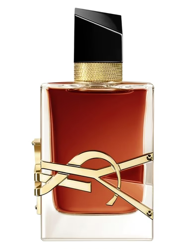  
*8/10*  
Mommy. Adopt me. Una donna con la testa sulle spalle, peccato per gli ex fidanzati. Impara a farti meglio heatless curls / blowouts, scegli se usare oro o argento invece di mixarli come una bambina che sceglie gli charm di Pandora per il 14esimo e sei a posto per la vita.

**GIORGIO ARMANI My Way**  
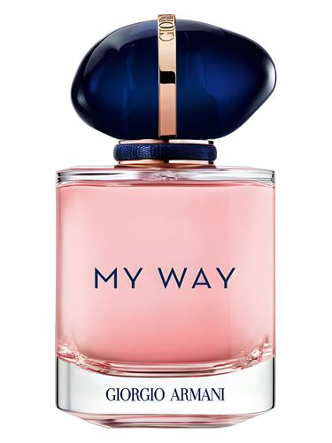  
*6/10*  
*Se La Vie Est Belle è l'inferno della banalità, My Way è la sua sala d'attesa con le riviste vecchie di tre anni.*  
Sei talmente noiosa, conformata e immovibile che ti lascerei senza descrizione, ferma nel tempo a una sufficienza. Sei in punizione, vai nell'angolino a pensare ai tuoi sbagli (ci vorrà un bel po'). Non vivi niente che non sia già stato approvato da un algoritmo. Scrivi "Traveler" nella bio perché ha fatto un weekend a Mykonos e uno a Parigi. Disperato bisogno di essere accettata dalla società borghese. Sei una manipolatrice passiva, nel senso che ottieni quello che vuoi facendo la parte della ragazza perbene, che non dice mai una parola fuori posto, che ha la cameretta arredata tutta in bianco e beige perché i colori ti spaventano quasi quanto l'idea di avere un'opinione originale. Se ti tagliassero uscirebbe acqua tonica sgasata. 
$$
X \in MyWay \Rightarrow Personality(X) = \lim_{t \to \infty} \frac{1}{TikTokTrend(t)}
$$
*Nota: Il limite tende a zero, circa come l'interesse che susciti in una conversazione che superi i 20 secondi.*

**GIORGIO ARMANI Sì**  
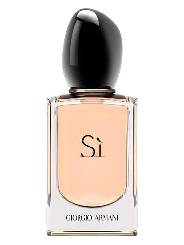  
*1/10*  
Ma sì cosa? Sì sono ritardata? Sì non ho mai genuinamente compiuto una buona azione nella mia miserabile vita? Sì i miei genitori non sopportano il fatto di avermi messa al mondo? Se il profumo l'hai preso per questo, ok. People pleaser. Traumatizzata. Ti bullizzavano, poi hai iniziato a bullizzare tu, e ora è un misto in cui credi di avere in mano il coltello dalla parte del manico ma in realtà ti perculano tutti e tu cammini col paraocchi.

**GIORGIO ARMANI Sì Passione**  
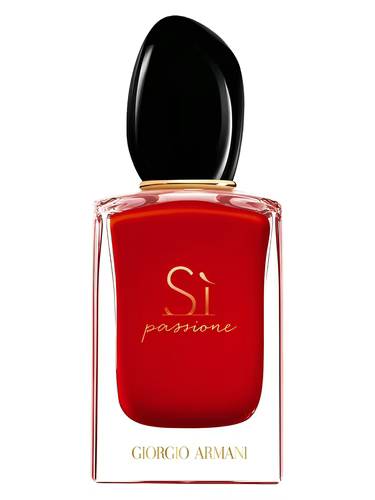  
*2/10*  
Se sei davvero, al 100% convinta che questo profumo lasci una scia minimamente seducente dietro di te, non so come convincerti che funzionerebbe meglio una scoreggia proteica. Probabilmente avresti più chance di farti rivolgere la parola dal tipo di uomo che cerchi.

**JULIETTE HAS A GUN  Not a Perfume**  
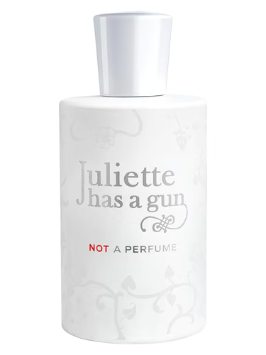  
*5/10*  
Ti credi tanto speciale perché "su di te ogni profumo cambia". Sei l'equivalente umano di un foglio excel vuoto.   
Bevi solo acqua a temperatura ambiente e il tuo colore preferito è tipo il greige.   
Minimalista? Tesoro, no, sei *terrorizzata* dall'idea di dare fastidio a qualcuno.

**BYREDO Gypsy Water**  
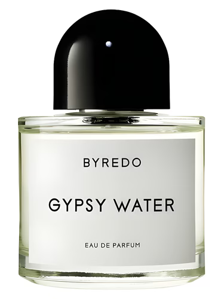  
*8/10*  
Hai un tappeto di cristalli in camera e fai yoga tre volte a settimana, poi la notte ti spari 20 gocce di ansiolitico.   
Spendere 200€ per un profumo che dura quanto un 13enne porn addict è una delle tue red flag principali.

**CHANEL Chance / Chance Eau Fraiche / Chance Eau Vive**  
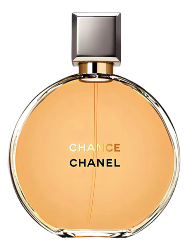
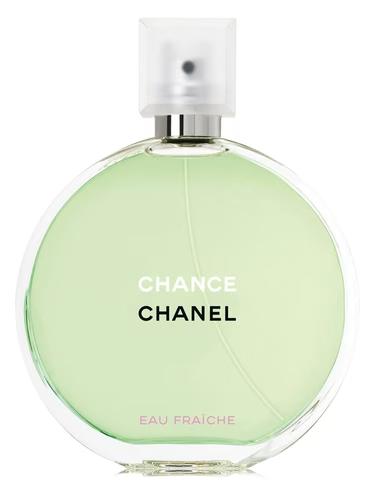
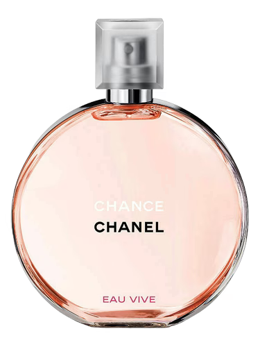  
*2/10*  
Il profumo di chi non ha mai preso una decisione autonoma in vita sua. Lasci che gli altri decidano per te per poi lamentarti passivamente che "non vieni mai ascoltata". Hai paura di osare, ti rifugi in un profumo che sa di pulito e "costoso" sperando che nessuno noti quanto sei anonima. Sei quella che alle cene non propone mai il ristorante perché "va bene tutto".

**CHANEL Coco Mademoiselle / Coco Mademoiselle Intense**  
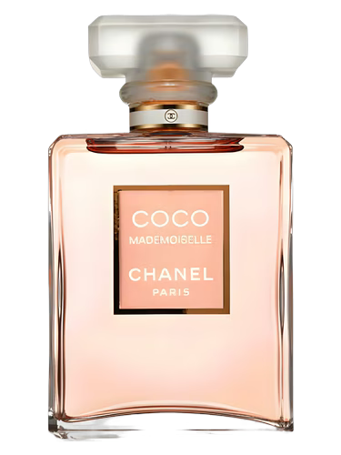
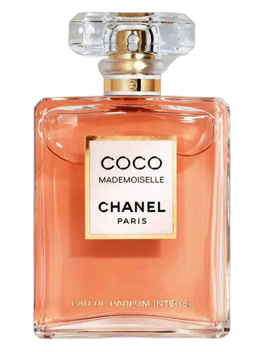  
*4/10*  
La signature delle stagiste che vogliono sembrare CEO. Pensi di essere una donna di classe ma è difficile se odori come la sala d'attesa di un centro estetico che prende i clienti da Groupon. Prevedibile quanto un cinepanettone con titolo combo "natale" \+ uno dei quattro punti cardinali. Acquisti ancora su Shein.

**D\&G Devotion**  
  
*10/10*  
Lo uso anche io. È un profumo molto buono che si addice a una persona dolce, di quelle che diventano appiccicose dopo cinque minuti. Con questo non voglio assolutamente dire che tu sia davvero dolce. Anzi, sei una stronza malata che finge costantemente di essere qualcuno che non sarà mai davvero.

**CHLOÉ Chloé Eau de Parfum**  
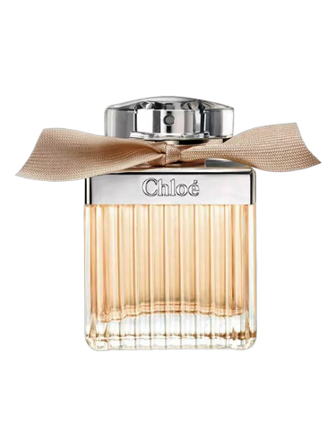  
*4/10*  
Premesso che non credo esistano profumi più auto-esplicativi di quelli che hanno la rosa dominante nelle note olfattive, di questo oltre lo scontato posso anche dire che vuoi proiettare l'immagine della ragazza educata, della figlia perfetta che ogni domenica va a pranzo dai nonni e non ha mai detto una parolaccia in vita sua. Sei quella che ai matrimoni piange "perché è tutto così bello" e poi passa il resto della serata a sparlare del vestito della sposa con le altre amiche lobotomizzate.

**CHLOÉ Chloé Eau de Parfum Intense**  
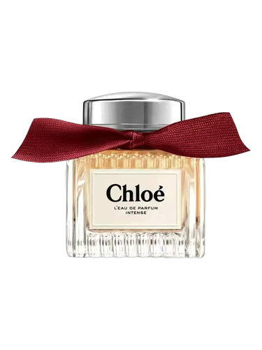  
*5/10*  
*public class ChloéIntense extends Chloé*, e l'attributo in più è *private boolean thinksShesDark \= true;* sei quella sopra ma con un ego leggermente più ingombrante e una scia che fa venire il mal di testa a chiunque ti stia vicino. Sei la prova che si può essere pesanti anche cercando di sembrare pulite. Sei una che posta citazioni di libri che non ha mai letto e che si finge tormentata perché fa figo. Mettiti il maglioncino di cashmere sintetico e torna a scrollare reel di gattini, "l'intensità" non sai manco dove sta di casa. L'unica cosa intensa nella tua vita è l'ansia che provi quando non ricevi abbastanza validazione esterna.

**CHRISTIAN LOUBOUTIN Loubirouge**  
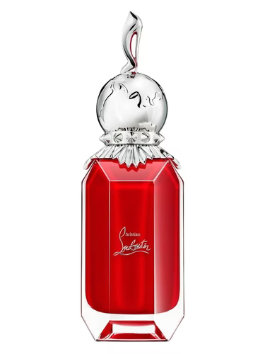  
*10/10*  
Diva indiscussa. Regina. THIS\! The shit I like. My *humble* type in women.

**VALENTINO Born In Roma Donna**  
  
*10/10*  
*My baby*. Amo questo profumo. Ma rimane la average ragazza che va in discoteca e si fa i selfie nel bagno per 3/4 del tempo, esce solo quando sente "Mi Gente" o "Ginza" in cassa. Ti ubriachi con 1 Sex on the Beach scarico. Basic baddie che crede di aver scoperto l'America. Adori i complimenti, ma non ne fai mai, e se li fai, lo fai solo per riaverli indietro; molto probabilmente neanche pensi davvero quello che dici. Compri i completini di Gymshark coordinati, fai i video mentre "ti alleni" (ovvero ti aggiusti il culo davanti allo specchio per 45 minuti) e poi torni a casa a mangiare pizza surgelata perché il tipo della palestra, che chiaramente metteva Eros o Sauvage, non ti ha degnata di uno sguardo.

**VALENTINO Born In Roma Donna Extradose**  
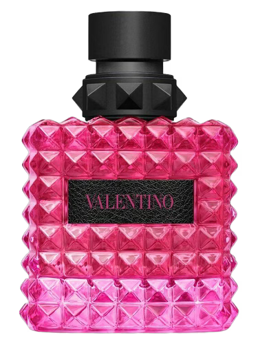  
*10/10*  
Spaziale lui. Tu in senso negativo, invece. Sei eccessiva, rumorosa e occupi troppo spazio vitale.   
Ricorda che l'unica cosa di "extra" che hai è il tempo che passi a editarti le foto.

**VALENTINO Born In Roma Donna Intense**  
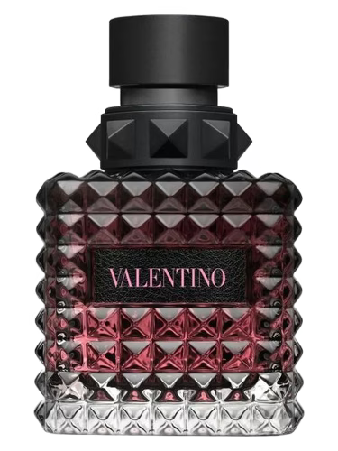  
*9/10*  
STALKING MASTER. E hai capito che per farti notare devi alzare il volume. Resti una che segue i trend come fossero la Bibbia, e non ritenerti salva, *public class valentinoBornInRomaIntense extends valentinoBornInRoma*.

**VALENTINO Born In Roma Donna Yellow Dream**  
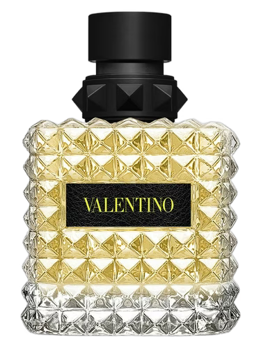  
*6/10*   
La limonaia a Capri, peccato che tu sai di detersivo per i piatti. Sei quella che fa le storie "Morning Routine" alle 6:00 del mattino con la luce naturale, dopo il video torni a dormire fino a mezzogiorno con la bava sul cuscino.

**VALENTINO Born In Roma Donna Coral Fantasy**  
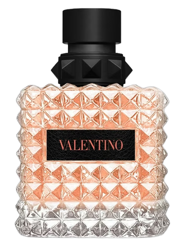  
*8/10*   
l tuo intero feed Instagram è un tramonto arancione sovrasaturo con la scritta "Golden Hour". Sei quella che ordina uno Spritz solo perché si abbina al vestito, lo fotografa da diciotto angolazioni diverse e poi lo lascia sgasare perché eri troppo impegnata a controllare le views delle storie. Pensi di avere "Main Character Energy" ma sei la comparsa con la gonnellina fru fru di Bershka che si vede mezzo secondo in un film osceno girato tipo a Riccione.

**VALENTINO Born In Roma Donna Green Stravaganza**  
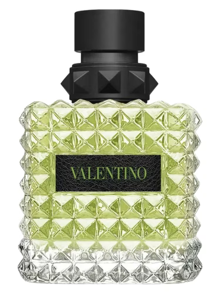  
*8/10*   
Quella che "io sono diversa, io bevo Matcha". Fai la fila di due ore pur di entrare da Starbucks. Dici a tutti che ami la natura e ma l'unica cosa verde che vedi regolarmente è il filtro "Indie" che usi per sembrare profonda ed enigmatica mentre fissi il vuoto fuori dal finestrino del treno.

**MAISON MARGIELA Lazy Sunday Morning**  
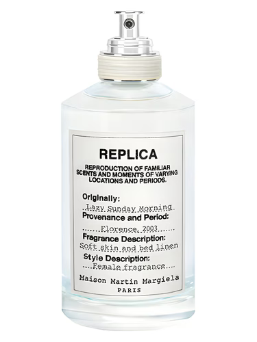  
*1/10*  
Ma come fai a scegliere come signature un profumo che sa di cane bagnato? Non dà la minima idea di pulito che pensi di trasmettere, non ricordi le lenzuola pulite, sai di lavanderia a gettoni. Hai un ego gonfiatissimo. Lo slick back in teoria andrebbe fatto una volta ogni tanto, lo fai talmente spesso (perchè spoiler: non ti lavi) che ora hai la stessa stempia del tuo fidanzato.

**MUGLER Alien**  
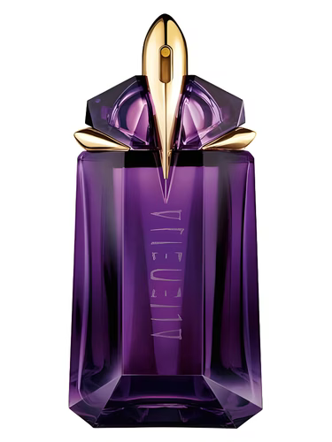  
*0/10*  
Osceno è un complimento. Aberrante. Abissale. Sei rimasta bloccata nel 2010\. O hai un disperato bisogno di attenzioni, anche se negative... questo profumo non lascia la scia come ti ostini a dire, commette un crimine di guerra biologico. Hai una personalità così invadente che Alien è l'unico modo per avvisare la gente di scappare prima ancora che tu apra bocca.

**DIOR J'Adore**  
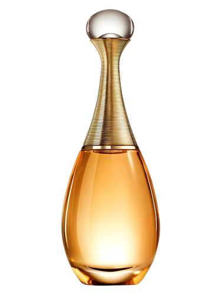  
*0/10*  
Stammi lontana 10km. Ah e palesemente conosci solo questo e hai in casa un 100ml che tuo padre usa giustamente per rinfrescare il bagno dopo aver cagato.

**DIOR Miss Dior / Miss Dior Blooming Bouquet**  
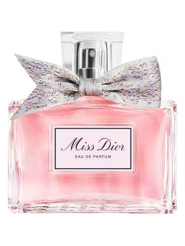
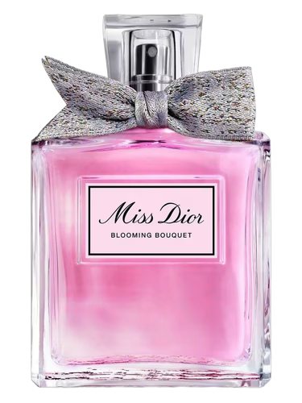  
*6/10*  
Ti credi una principessa di un film Disney. Piangi in bagno dopo due spritz perché il tipo conosciuto da 2 giorni non ti ha risposto. "Bow coquette" nell'estetica e esaurimento nervoso nella pratica. Insopportabile da avere nella stessa classe, alle medie eri molto apprezzata e adesso ricerchi quelle attenzioni, ma non le riavrai mai, perché ai ragazzi non piacciono più quelle come te. Dovresti fingere di essere più come il tuo paparino per riaverli ora.   
Provaci\! Ah no… il paparino è andato via tanto tempo fa…

**DIOR Hypnotic Poison**  
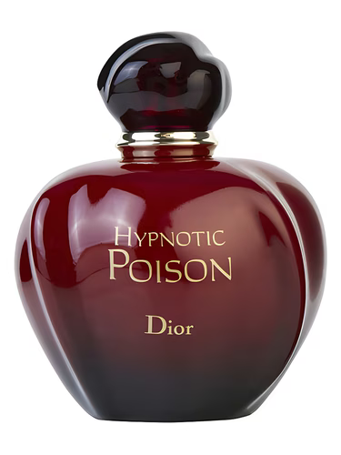  
*6/10*  
Tu e questa cazzo di mandorla. Ti senti una seduttrice letale, una ragazza che lascia il segno, sei rimasta bloccata all'idea di seduzione che avevi a 16 anni. Pensi di essere Monica Bellucci e l'unica gente che stordisci è quella che poverina ti trova in ascensore. Se lo usi in estate meriti un girone personale. Posso dire quasi con certezza che fumi, quindi il misto di tabacco, sigaretta, rossetto di Yves Rocher e Hypnotic Poison… devo davvero commentare? Che *schifo*

**DIOR Poison Girl**  
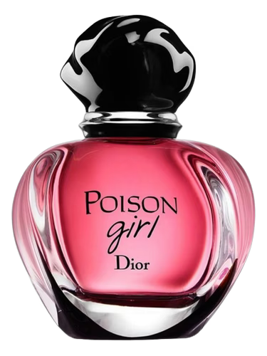  
*6/10*  
Lo usavo alle medie. Non so. Devo dire altro? Il profumo è bait pura, si chiama Poison Girl e l'unica roba che dà idea di essere stridente è l'arancia amarissima in apertura, poi si spegne tutto e diventa una bomba zuccherata diabetica che ti fa pentire di essere nata.

**LANCOME La Vie Est Belle**  
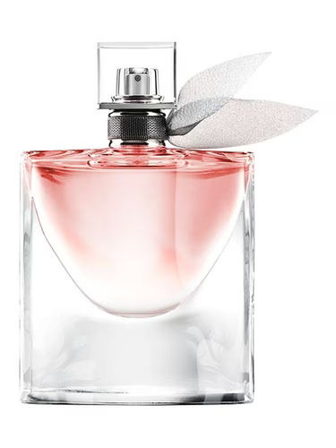  
*1/10*  
Il vuoto pneumatico fatto a persona. Letteralmente il "Live, Laugh, Love" dei profumi. Wannabe sweet girl ma sei un serpente e neanche sei capace a fare la stronza. È  talmente dolce e onnipresente che manda diabete istantaneo a chiunque si trovi nel raggio di 5 km. Se lo usi e ti piace DAVVERO, la tua massima aspirazione è una giornata all'outlet. E poi comunque ordinerai a casa su TEMU i corrispettivi. Acquisti ancora su Shein. Ti sei rasata la faccia almeno una volta per la glass skin.

**KILIAN Love Don't Be Shy**  
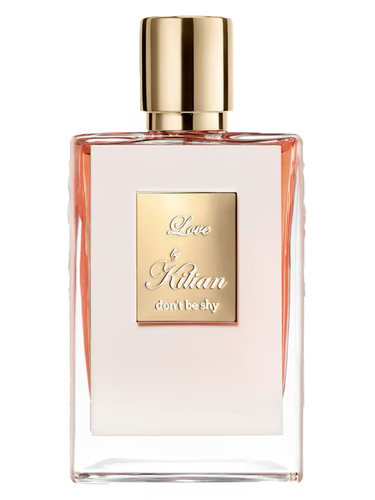  
*9/10*  
Qui le opzioni sono due: sei ninfomane e bella da far venire i brividi, o sei ninfomane e rompi gli specchi quando rivolgi lo sguardo verso di loro. Sinceramente adoro questo profumo, il che implica che ho cose terribili da dirgli; comunque, tu ti sai *gestire* relativamente bene. Anche se sei spesso giudicante, non lo dai a vedere e nascondi bene quanto in realtà detesti metà delle persone che ti ronzano attorno. Il profumo lo conosco e so che è persistente, quindi se è la tua signature, vuoi dare nell'occhio, e se vuoi dare nell'occhio in QUESTO modo, il papà deve averci dato dentro in infanzia. You know how they say? Loved with *every inch*.

**GIARDINI DI TOSCANA Bianco Latte**  
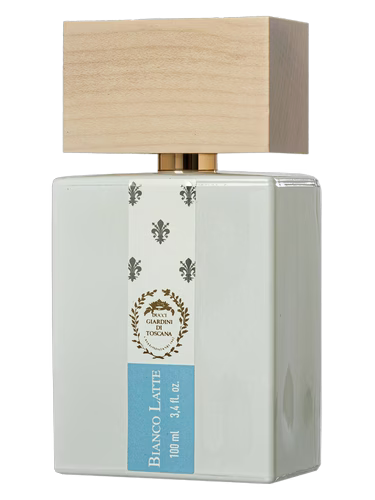  
*8/10*  
Wowww siii\! Che bello\! Odori di un frappè alla vaniglia lasciato a 40 gradi al sole\! Provi a fare la clean girl. Non hai preso mezza decisione buona nella vita. Ossessionata dall'approvazione altrui, compri tutto quello che vedi su tiktok/instagram. Mi dai idea di lavarti poco.

**LATTAFA Eclaire**  
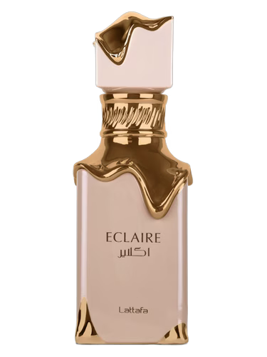  
*7/10*  
La versione disperata di quella che mette Bianco Latte. Almeno lei ha speso i soldi per fare la sua parte. Tu non solo vuoi odorare di pasticceria industriale ma vuoi pure farlo risparmiando perché hai speso tutto il budget in skincare inutile (e sbagli anche gli step). Sei un incubo per le narici, le orecchie e i neuroni altrui. Molto probabilmente ti sei rasata la faccia con quelle lamette di plastica e ora sei rovinata a vita.

**MAISON ASRAR Vanilla Voyage**  
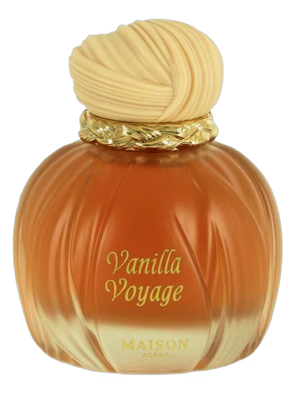  
*7/10*  
Bancarella di dolci. Troppo, troppo invadente. Fai venire male al naso e alle orecchie anche tu. Mi spiace che ti abbiano presa di mira da piccola ma non è con un profumo al caramello, miele e burro che risolverai i traumi.

**ENRICO COVERI Contemporary Girl Vanilla Lover**  
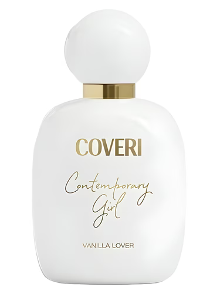  
*7/10*  
Questo è il mio profumino pre-nanna. Costa stra poco e sa di latte, zucchero e vaniglia. Talmente dolce che dopo 4 spruzzate entra nel naso, pizzica e fa venire un prurito alle narici che rende una tortura piacevole. La crema corpo è 1000x. Anyway, anche tu, Bianco Latte wannabe, vuoi troppe attenzioni, ti fai centoduemila foto al giorno (poi se ne salvano 2 ma quello è un altro discorso), egoista, meschina, grande bugiarda.

**CAROLINA HERRERA Good Girl**  
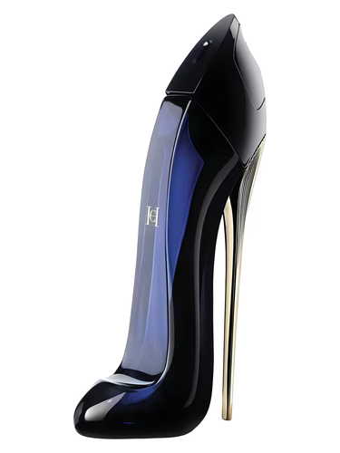  
*9/10*  
My baby. Love him so much. Rimangono molte, molte, molte critiche da fare però.    
Ti senti una femme fatale ma non sai manco camminare sui tacchi (con la t volutamente minuscola, visto che molto probabilmente non sai cosa significa infilare il tuo tiktokiano 37 smalto bianco in un Tacco vero e degno) e finisci la serata con le Air Force di 3 anni fa coi buchi. Ti impegni e cerchi di essere trasgressiva ma inevitabilmente fallisci. La mossa che fai quando spruzzi dalla bottiglia di profumo è forse la cosa più femminile che riesci a fare insieme alle seghe troppo veloci. Il tuo papà (se è ancora raggiungibile) piange quando ti vede i vestiti per uscire il sabato sera.

**CAROLINA HERRERA Good Girl Blush**  
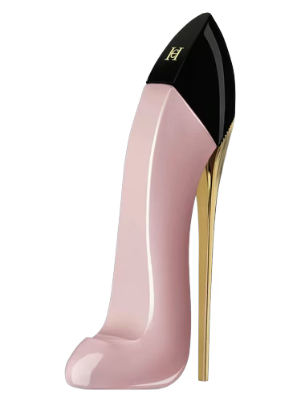  
*7/10*  
*public class GoodGirlBlush extends GoodGirl*, ma con meno coraggio e più figlia della propaganda del colore rosa. Sei la versione soft di una che vorrebbe essere cattiva e poi chiede scusa anche ai mobili quando ci sbatte contro. Total people pleaser. ti piaceva il trend "okokok lalalala" perchè hai bisogno di essere babied nelle braccia di qualche bastardo che ti mette le corna 2 volte al giorno. Continua pure a spendere 60 euro di babyboomer dall'estetista e ricorda che con gli stessi soldi ti fai una seduta dallo psicologo (almeno una) (e non scopartelo).

**CAROLINA HERRERA Very Good Girl Elixir**  
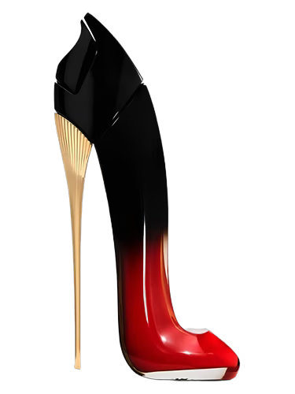  
*9/10*  
Non avevi i soldi per TF Lost Cherry? Immagino di no. In ogni caso, baddie. Questo è un profumo perfetto per una ragazza molto bella che sa perfettamente di esserlo e non nasconde neanche di saperlo. Ho una discreta stima per te, se non fosse che sei una bastarda, ma una bastarda tale, falsissima, bodyshamer, stronza di prima categoria. Ti vesti sempre di nero.

**CAROLINA HERRERA Very Good Girl Glam**  
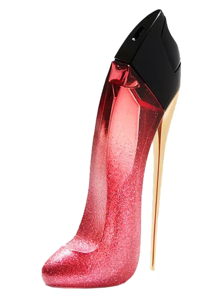  
*10/10*  
Mi piaci. Sai come divertirti, però ti rispetti, e prendi in giro i manipolatori manipolandoli facendogli credere che stiano riuscendo a manipolarti.

**KAYALI Vanilla | 28**  
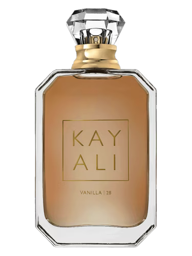  
*9/10*  
Ossessionata dal layering. Non ti basta un profumo, ne devi mettere sette perché "vuoi creare la tua firma". In realtà odori solo di vanillina chimica di merda. Sei innocua ma noiosissima. Chubby vibes. Te ne spruzzi a quintali sperando di avvicinare la gente ma ha l'effetto opposto. Ti crei una nube che repelle qualsiasi essere. Meglio? Ofc not, attention keeps you alive…

**KAYALI Yum Boujee Marshmallow | 81**  
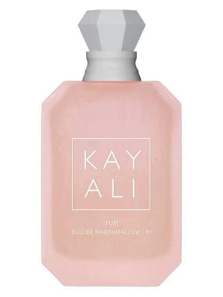  
*10/10*  
L'ho avuto. Lo mettevo quando volevo sembrare una tenerina. Non funzionava. Anche perchè lo indossavo tutta vestita di nero con due occhiaie che mi arrivavano ai piedi, non è proprio il mio vibe. Ma funziona su una ragazzetta 150cm che si veste come una Winx. Quindi o sei così, o sembri una cretina che vuole odorare di bancarella di dolci festiva. Non ti sta bene. Hai mai chiesto tipo… boh… a un parrucchiere per quei capelli?

**KAYALI Vanilla Candy Rock Sugar | 42**  
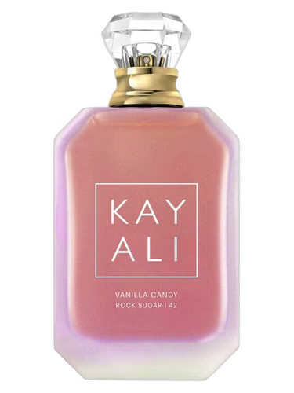  
*10/10*  
L'ho avuto. Molto simile a quello sopra. Anzi, farei copia incolla, ma poi fa brutto.  
Di sicuro hai il culone. Poi che sia bello o brutto non lo so, però hai il culo grosso.

**KAYALI Yum Pistachio Gelato | 33**  
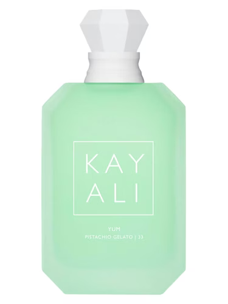  
*8/10*  
Oddio vorrei dire qualcosa di carino perchè la fragranza in sè è buona e molto dolce nello stile delle due sopra, classico Kayali gourmand, ma sei l'equivalente degli influencer ossessionati col pistacchio che se lo mettono pure nel culo quindi non lo so… stai nel tuo…

**KAYALI Eden Juicy Apple | 01**  
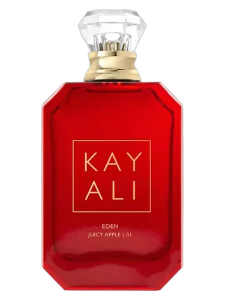  
*9/10*  
Sei una persona tanto sensibile. Permalosissima. Ti cibi di relazioni effimere e vai avanti da anni con le stesse persone perchè hai il terrore dei cambiamenti. Non accetti che qualcuno ti dia una critica costruttiva. Però, sei molto bella.

**KAYALI Oudgasm Vanilla Oud | 36**  
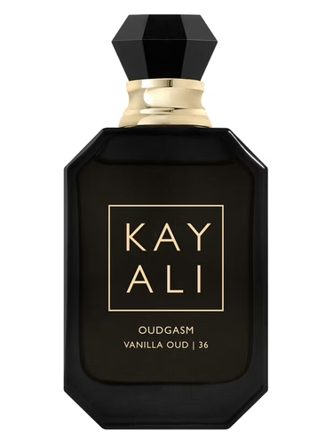  
*10/10*  
Diva. Nient'altro da dire. Non sbagli niente. Keep it real and keep it evil (e se vuoi sposarmi sono qui).

**YSL Black Opium**  
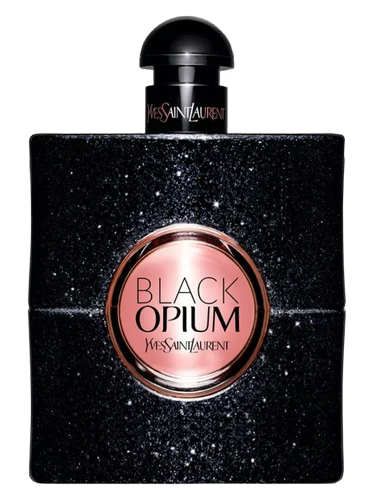  
*5/10*  
La baddie dei poveri. La ragazza che nel 2014 repostava su instagram foto di sigarette da weheartit e citazioni tristi su tumblr e spoiler, sei ferma lì. Puzzi un bordello, il deodorante da 3 euro di Bon Bons Malizia non funziona anche se provi a layerarlo col caffè del tuo Black Opium… ti lavi in doccia con i bagnoschiuma dell'Aquolina che sanno di cemento anche se sopra c'è scritto "Unicorno Zuccherato". Sei veramente ma veramente convinta di avere chissà quale aria di mistero intorno a te, non ne hai, davvero, sei scontata come poche, prevedibile in ogni tua frase e mossa, e smettila di fumare al mattino, la tua pausa terea non ti rende figa, ti rende imbarazzante, butta quella iqos di merda e inizia a studiare sul serio che non te lo trovi il marito ricco conciata in quel modo.

**YSL Black Opium Glitter**  
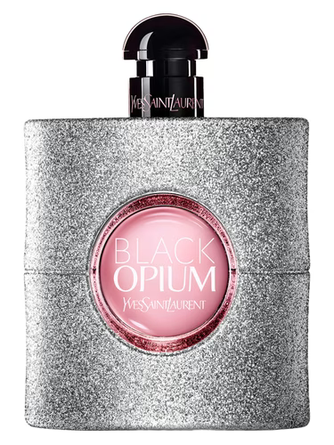  
*8/10*  
Devi andare in palestra. E sei troppo kitsch, non ti si addice, l'attenzione che attiri non ne vale la pena, fidati.

**YSL Black Opium Extreme**  
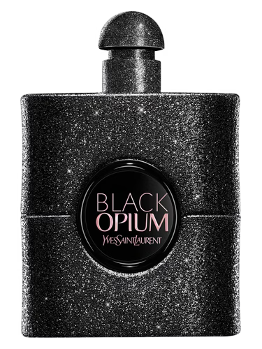  
*8/10*  
Baddie. Anche io vorrei i tacchi YSL, tranquilla, non sei l'unica che sta risparmiando per averli. Comunque sei sempre cattiva, troppo. Devi imparare anche a tenerti vicino qualcuno. Volevi sangue, eccoti il massacro…

**PACO RABANNE Olympéa**  
  
*6/10*  
Sinceramente mi spaventi. Sia per i gusti pessimi che per come *sei*. La tua vita è un caos primordiale che cerchi di tenere insieme con le unghie finte e Instagram. Sei quella che si definisce "un uragano", "difficile da gestire", "una guerriera", in realtà sei una ragazza con una soglia dell'attenzione di tre secondi e una lista di ex che hanno dovuto fare terapia di gruppo per riprendersi dal tuo lovebombing. Sei stucchevole, invadente e il problema è che sei fottutamente convinta di essere un premio.

**YSL Mon Paris**  
  
*6/10*  
La almond mom deve proprio averti rovinato la vita. Body dysmorphia at its PEAK\! Comunque sei insopportabile, noiosa, ma bellissima.

**PARFUMS DE MARLY Delina / Delina Exclusif / Delina La Roseé**  

  
*9/10*  
Roba seria. Ti stimo, non posso fare altro. La "Mean Girl" definitiva. Sei quella che sorride mentre ti dice che il tuo vestito "ti sta bene" e intanto pensa a come rovinarti la vita. Sei viziata, pretenziosa e il tuo unico talento è far sentire tuo padre in colpa per non averti comprato l'ennesima borsa da 6k. Vuoi saturare lo spazio vitale di chiunque ti circondi.

**NARCISO RODRIGUEZ For Her Eau de Parfum / For Her Musc Nude**  
  
*5/10*  
Ti piace l'idea di essere "indimenticabile". Lasci segni difficili da cancellare nella mente degli altri, si… a libera interpretazione. Non sai scopare. Tabula rasa emotiva. Stupida come un sasso. Preda preferita di ogni narcisista tossico perché non hai abbastanza neuroni per opporre resistenza. Usi questo profumo perché speri di sembrare "innocente ma sexy", ma l'unica cosa che proietti è una disponibilità disperata e una totale assenza di spina dorsale. Sei quella che si fa ghostare dopo due settimane e continua a mandare messaggi "perché abbiamo una connessione". No, hai un profumo che sa di ammorbidente e un pessimo rispetto per il tuo corpo. Ah e
$$
X \in (ForHer) \cap (Bella) \Rightarrow BodyCount \in (20, 50)
$$

**NARCISO RODRIGUEZ All of Me / All of Me Intense**  

  
*8/10*  
Se lo indossi hai tanto tanto bisogno di approvazione maschile, e ti infastidisce, perchè in fondo sai che è una pessima scelta per la tua salute mentale ma non riesci a fare altrimenti e, per quanto tu ci vada razionalmente contro, il tuo cuore va sempre al contrario. Un cuore che tralaltro, molto probabilmente, è stato fatto a pezzi da un CESSO A PEDALI. Non ami il tempo in solitudine. Sei insicura del tuo aspetto.

**GIVENCHY L'Interdit / L'Interdit Rouge**  

  
*4/10*  
"L'oscurità proibita". Ma di che? Hai paura pure della tua ombra. Sei quella che fa la misteriosa sui social e posta le foto in bianco e nero. Cerchi di attirare uomini "complessi" per poter dire che li hai "salvati" (spoiler: devi prima salvare te stessa). Hai una vita eccitante quanto una riunione condominiale. Odi qualsiasi cosa sorrida solo perché tu non lo fai da 10 anni. Solo nei selfie, ma vengono una merda, allora fai le mirror pic ai capelli e metti una canzone di Ultimo.

**ZADIG & VOLTAIRE This Is Her**  
  
*7/10*  
"Vado a vivere in una baita" e ti porti il Macbook. Impara a metterti il mascara senza fare quei grumi osceni, e basta con quel cazzo di slick back, lo sappiamo che ti fai la doccia ogni 5 giorni, si sente molto bene. Smettila di comprare su Shein.

**YSL Black Opium Over Red**  
  
*10/10*  
Nei miei sogni sono fidanzata con una donna che mette questo profumo.

**TOM FORD Black Orchid**  
  
*3/10*  
L'hai rubato a tua madre. O a tua zia. Non accetto altre opzioni.   
Quantomeno, ti rispetto, perchè con questo profumo lo urli apertamente che sei una *stronza* del cazzo.  
Non ti piace nemmeno davvero, forse ti ci sei abituata, col naso da 30cm che ti ritrovi in faccia (Pinocchio, non è per bodyshaming, è che sei una bugiarda patologica). 

**JEAN PAUL GAULTIER La Belle / La Belle Le Parfum**  

  
*10/10*  
Ci provi, ma ci provi TANTO, a sembrare una brava persona, ogni 4 secondi ti cala la maschera perché non riesci a trattenere le espressioni facciali. Sei molto bella esteticamente. Dentro sei una serpe però, hai la lingua che taglia tanto, e forse nemmeno ti piace il tuo carattere ma non fai assolutamente nulla per cambiarlo. E hai rotto il cazzo con il french colorato alle unghie. Cambia qualcosa ogni tanto invece di tremare alla sola idea che gli altri ti vedano in modo differente.

**JEAN PAUL GAULTIER Scandal**  
  
*4/10*  
La volgarità fatta a boccetta. Se lo usi pensi che "essere una donna forte" \== maleducazione. Puzzi di disperazione.   
Cerchi di attirare l'attenzione stordendo le persone perché sai che se dovessi puntare sulla conversazione rimarresti sola in tre secondi. Sei quella che fa le scenate di gelosia in pubblico per farsi guardare. Un incubo.

**JEAN PAUL GAULTIER Scandal Le Parfum**  
  
*6/10*  
Devi veramente curare i problemi con la tua autostima, e non con l'ennesimo uomo tossico; lavora su te stessa, ti prego, un POCHINO di introspezione alla volta, puoi farcela\!

**JEAN PAUL GAULTIER Gaultier Divine**  
  
*7/10*  
Tu sei folle, stammi lontano, ma non folle come piace a me, proprio insopportabile. Ti piace il sushi, ma tanto, quasi da spendere 40 euro di all you can eat al sabato sera. Dovresti imparare un po' cosa significa ascoltare gli altri, ogni tanto. Non dico che ti debba interessare, ma almeno fai finta. E smettila, smettila di fare la gatta morta.

**ZARA (Qualsiasi)**  
*Dipende.*  
Non so se categorizzarti come una ragazza ferita, con tante insicurezze, che cerca di risparmiare perchè mentre prova a sentirsi una donna deve anche mantenersi, oppure semplicemente come una rincoglionita che scopre che Eau de Toilette non significa che lo devi spruzzare dopo che caghi. Anche se sarebbe l'uso giusto per molti degli ZARA dupe.

**MAISON FRANCIS KURKDJIAN Baccarat Rouge 540**  
  
*10/10*  
Boh sposami? Baciamoci?

**GUERLAIN Mon Guerlain**  
  
*7/10*  
Non sai ballare. Ma proprio zero. Sei uno stecco di legno. Sei bellissima, la gente si aspetta sempre troppo da te e tu ti sei rotta il cazzo. Insegui il modello di ragazza che vorresti essere da anni, lo fingi bene, ti soddisfa ma non del tutto. Probabilmente ti piace preparare i dolci, hai 7h al giorno di scrolling su tiktok, sei brava a studiare ma non lo fai mai. Procrastinatrice seriale.

**GUERLAIN Shalimar Eau de Parfum / Shalimar L'Essence**  

  
*9/10*  
Hai problemi a gestire la rabbia. Sei molto intelligente, non riesci a fingere intorno alle persone stupide o superficiali. In faccia ti si legge spesso la verità prima che tu stessa la dica con le parole. Spesso hai dovuto portare avanti le cose da sola e ti sei costruita una bella corazza. Però ti devi evolvere un pochino. Sei un po' rimasta ferma nel tuo passato.

**CAROLINA HERRERA La Bomba**  
  
*9/10*  
YESSSSS GIRLLLLLL\! Mi piaci. Ma tanto. Sei bella, ma bella fr, giving VS model body \+ face card.

**BURBERRY Burberry Her**  
  
*7/10*  
Sei una ROMPICOGLIONI di *ULTIMA* categoria. Veramente rompi le palle a chiunque. Hai sempre da ridire, lamentarti, guardare male. Non ti sai fare le foto. Nauseabonda come il profumo. Molto molto stupida. Quando cazzo le togli le foto con l'ex dal telefono? Cosa aspetti? Di fargli la videocassetta come in 13 reasons why?

**BURBERRY Goddess**  
  
*9/10*  
Non hai bisogno di urlare per farti notare. Tutto sommato sei una buona versione delle vanilla lovers lobotomizzate che usano i dupe di Zara e hai più o meno capito che la così ricercata "classe" sta nella semplicità, fatta bene. A partire da questo tuo desiderio, vorresti molti più soldi di quelli che hai, e non hai *veramente* ambizioni per il tuo futuro; insomma, vanti tanto di fare tutto in autonomia e praisi l'indipendenza, ma in fondo lo sai che vorresti N sugar daddy ricchi sfondati che ti sbavano dietro e ti comprano la cella frigorifera per le borse che ti comprano.

**PENHALIGON Changing Constance**  
  
*10/10*  
Andiamo a firmare le carte, tu devi essere mia.

**PRADA Candy**  
  
*8/10*  
Sei quella che fa la voce da bambina per ottenere quello che vuole e che usa il "sono solo una ragazza" come scusa per ogni tua cattiveria gratuita. Hai l'emotività di un cubetto di ghiaccio e ti ostini a comprare accessori rosa e a fare la tenerina su TikTok. Sei la prova vivente che il diabete olfattivo può nascondere un cuore di uranio. La gente si avvicina per il dolce e resta incastrata nella tua ragnatela di complessi e bugie patologiche. Complimenti per il travestimento, però, fottutamente geniale quanto tossico. 

*"Non è che se ti fermi ad accarezzare i gattini per strada sei un'anima buona, troia di merda"*
*Instagram Reels*

**GHOST Orb of Night Elixir**  
  
*9/10*  
Ti desidero NO joke TAKE ME! I'M ALL YOURS!

**KILIAN Angels'Share**  
  
*8/10*  
Chi ti ha detto che sei un po' mascolina da piccola ti ha proprio rovinato.

**BILLIE EILISH Eilish no. 1**  
  
*10/10*  
Purtroppo anche questo è stato la mia signature circa dal 2021 al 2024, quindi non posso tradirlo con una recensione troppo personale; rimane un profumo per ragazze che devono ancora, in fondo, scoprire qualcosa di oscuro che le riguarda e le tiene ancorate ad una vita che non vogliono davvero fare e si convincono di meritarsi per pigrizia o infelicità.

**ARIANA GRANDE Cloud / Ari / Sweet Like Candy**  

  
*6/10*  
Non so, amore, siamo nel big 2026, non credi sia ora di provare a guardare un po' oltre le tue Alexander McQueen? Devi provare a crescere, guarda il mondo, il tempo scorre, sei ancora immobile nell'unica era in cui ti sentivi di valere qualcosa, e avevi a malapena quindici anni al tempo… dacci dentro, per l'amor di dio. E basta stalkerare ex talking stages.

**CHANEL no. 5**  
  
*3/10*  
O hai 85 anni o sei una vittima del marketing ferma al 1950, ti ostini a dire che è "senza tempo" solo perché non hai il coraggio di ammettere che sa di sapone per le mani e lacca per capelli.

**CHANEL Allure**  
  
*3/10*  
Studi moda. E di moda non sai un cazzo. Profumo vecchio secoli, devi averlo trovato in qualche cassetto, altrimenti davvero non me lo spiego. Non sei classy se usi questa acqua aromatizzata, giuro che fa schifo a chiunque, se ti piace davvero hai tra i 40 e i 65 anni. *Detesto gli agrumati Chanel comunque, spero si noti dalle valutazioni.*

**MUGLER Angel Muse**  
  
*4/10*  
Vetiver mischiato a una qualunque nota di cacao, cioccolato e affini nel mio naso fanno a pugni e assieme li trovo osceni nonostante da soli li apprezzi. Hai una vena vintage che ti spinge a thriftare spesso i vestiti da nonna. Non hai molto stile e credi di averlo, sei come quella sopra che studia moda e poi abbina le Louboutin fluo a dei collant rosso vermiglio e si sente Miranda Priestly. Anyway, il profumo per fortuna è fuori produzione; lo metto per correttezza, i Mugler vanno insultati tutti e bene.

**VERSACE Pour Femme Dylan Purple**  
  
*2/10*  
Di questo ho proprio a casa, qui, di fianco a me la miniatura. Un odore insopportabile. Aspro e immaturo, una presa in giro. Mi dà l'idea di essere un profumo per una tamarra. O non so, una dei Quartieri Spagnoli che ha il marito nella Camorra? Non saprei. Comunque sei scema in culo, inutile spruzzarsi il profumo quando non fai la doccia per 8 giorni.
