# UOMINI

**DIOR Sauvage**  
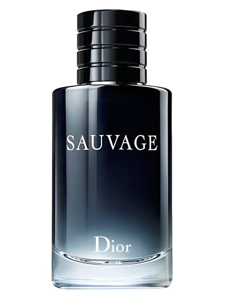  
*9/10*  
Il cavallo di battaglia. L'assoluto, l'invincibile, insostituibile, insopportabile Sauvage. Il paziente zero della tossicità. Invasivo, molesto, insofferente, profondamente e splendidamente *irritante*. Non sai leggere i contesti sociali. Non ti sai vestire. Sei un un manipolatore da quattro soldi patetico e radioattivo, usi tecniche da rookie, non sai bene quello che fai, hai molta esperienza alle spalle perchè hai iniziato presto ma punti bene o male sempre alle stesse vittime; molto probabilmente ti è davvero piaciuta una donna e poi non ti sei mai più ripreso (spoiler: avevi 13 anni, vedi di svegliarti). Se lo metti e non dici bugie dalla mattina alla sera, sei un coglione che ruba il profumo al papà per andare al Polaris. Sei molto probabilmente moro e alto. Ah e, I hate to break it to you but, te l'hanno mai detto che i denti si lavano almeno 3 volte al giorno?

**ESCENTRIC MOLECULES Molecule 01**  
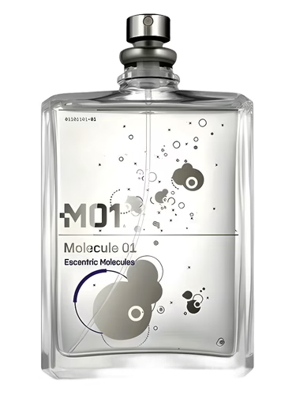  
*10/10*  
Andiamo assieme a vivere in una casa, in montagna, senza internet, dimmi come ti piacciono le uova la mattina, ti amo.

**VERSACE Eros**  
  
*6/10*  
Alle medie mi piaceva. Poi ho avuto a che fare col tipo di cliente, *per fortuna non romanticamente*. TAMARRO 100%  
Classico ragazzo con lo spray all'acqua di mare che si tocca il ciuffo ogni 4 secondi, HAI ROTTO IL CAZZO, sei un roito lo stesso. Insopportabile. Re dei breadcrumber, dai quel tanto che basta per tenere una ragazza legata e quando si gira ti trasformi nel predatore più viscido su cui si sia mai posato il peccato umano. La tua massima aspirazione è farti fare un video mentre guidi una macchina che non è tua, con la trap a palla e il braccio fuori dal finestrino. Se una donna ti frequenta è perché ha un trauma irrisolto e tu ne sei la perfetta incarnazione aggiornata, e non è un complimento; devi crescere. Immaturità clinica.

**CREED Aventus**  
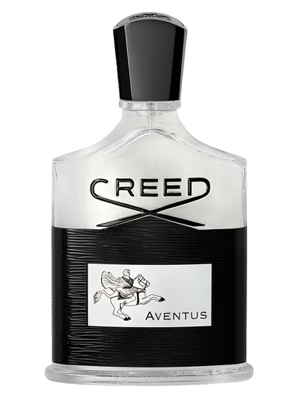  
*8/10*  
Narcisismo patologico legato al conto in banca. Il ragazzo che non accetta un "no".  Uno che non ama nessuno se non lo specchio. La tua vita è una continua gara a "chi ce l'ha più lungo". Sei il tipo che parla di investimenti, startup e mindset mentre cerca di convincere una ragazza a fare 50/50 alla prima cena. Spoiler, spenderesti soldi che non hai guadagnato lo stesso. Manipoli le persone facendole sentire inferiori alla tua presunta ascesa sociale. Sei noioso, ripetitivo e puzzi di ananas bruciato e disperazione per uno status che non avrai mai veramente. La tua boccetta costa 400€ ma la tua dignità non arriva a 5 centesimi. Un vuoto a perdere in giacca e cravatta.

**JEAN PAUL GAULTIER Le Beau Le Parfum**  
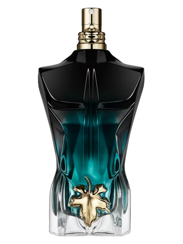  
*7/10*  
Narcisismo estetico estremo. Passi più tempo davanti allo specchio che a interagire con la realtà. Vuoi essere guardato, ammirato, desiderato, ma non hai assolutamente nulla da offrire oltre alla superficie. Un manichino di plastica con l'ego ipertrofico.

**CHANEL Bleu / Bleu Eau de Parfum**  
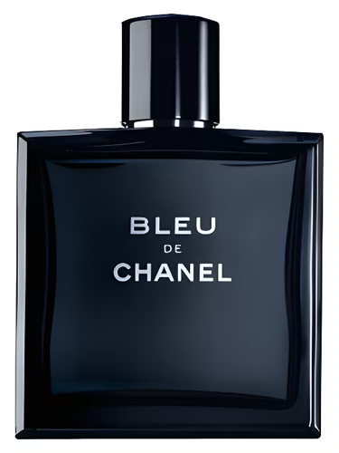
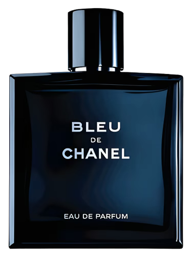  
*8/10*  
NPC. L'uomo corporate. Venduto l'anima al sistema. Manipolatore passivo-aggressivo, punisci con il silenzio. Sei uno che fa tutto "come si deve" per poi rinfacciarlo alla prima occasione. La tua capacità di provare emozioni reali è paragonabile a quella di un foglio di calcolo. Sei il compagno perfetto per una donna che vuole annoiarsi a morte per i prossimi anni della sua vita. Hai problemi di rabbia. La gente ti odia, comunque. Sappilo.

**CHANEL Bleu (Parfum)**  
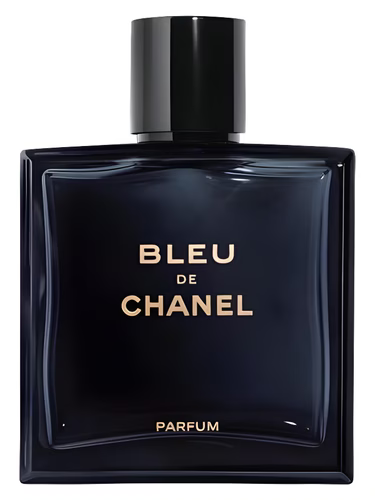  
*9/10*  
Hai classe, non la si vede spesso negli uomini, quindi un punto a tuo favore c'è sempre e comunque. Ti fai notare, discretamente; nel tuo, lavori bene. Però rimane un piccolo problemino… sei pulito, bellissimo, ordinato, impeccabile e assolutamente *senza palle*.

**CHANEL Bleu (L'Exclusif)**  
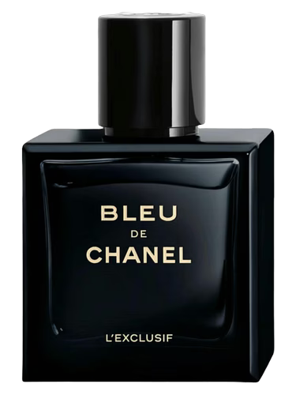  
*10/10*  
Sono tua. Nient'altro da dire.

**ESCENTRIC MOLECULES Molecule 02**  
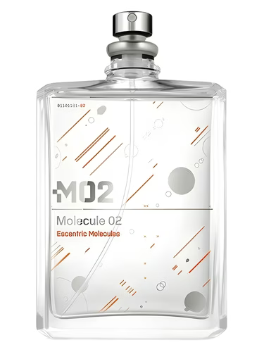  
*9/10*  
Non cercare di nasconderti. Ti abbiamo beccato. Sei un ex Sauvage user, hai solo trovato un profumo più figo che non ti solda subito a manipolatore… peccato che abbia lo stesso odore del drydown di Sauvage EDT…

**BVLGARI Man Wood Neroli**  
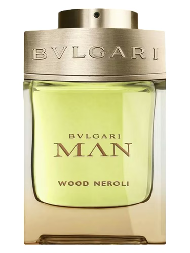  
*10/10*  
Non voglio sentire UNA parola contro questo profumo. Lo adoro. Se è la tua signature, però, è uno 0 e 1: o sei bellissimo, gentile, bravissimo e con un pisello enorme quanto il tuo rispetto per le donne, oppure sei un topo di fogna e l'hai tipo trovato per terra.

**GIVENCHY Pi**  
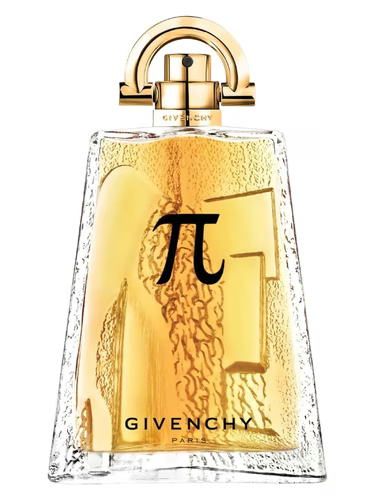  
*8/10*  
Sei un figo. Però sei anche un pirla. Cioè, non capisci davvero un cazzo. Non sai scrivere, a malapena sai cosa significa coniugare un verbo correttamente. Dovresti ripassare la tua lingua madre ma sei troppo occupato a stempiarti nel tuo settimo anno di triennale al PoliMi (sede Leonardo, rigorosamente ingegneria).

**D'ANNAM White Rice**  
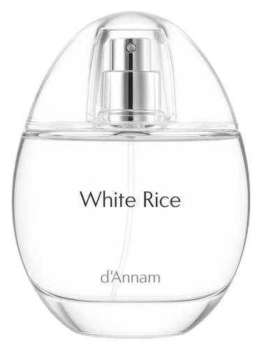  
*10/10*  
Ma non è che ti andrebbe di tirar su famiglia? Se non sei pronto posso aspettare.

**GIVENCHY Gentleman Eau de Parfum Reserve Privée**  
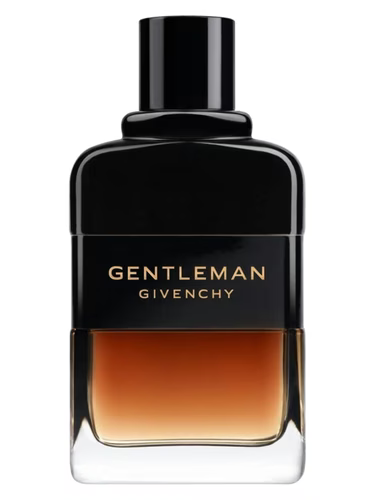  
*10/10*  
Classe pura. Boozy. Whiskey. Sei un uomo della madonna. Peccato davvero per la hairline che ti ha salutato a 17 anni dopo le delusioni d'amore. Arriva l'ora di farsi pelati, chiedi aiuto su r/bald. Anyway, molto, molto affine all'uomo che usa Dior Homme Intense. Siete simili. Ma con più eleganza, quasi femminile (quindi niente di male).

**PRADA L'Homme / YVES SAINT LAURENT L'Homme**  
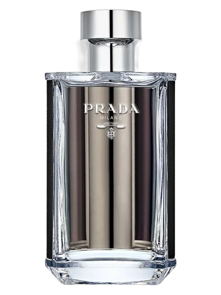
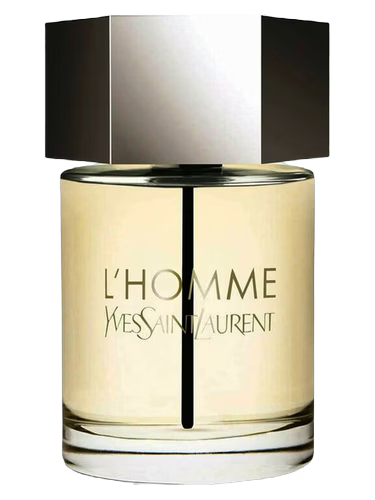  
*6/10*  
L'uomo "pulito". Quello che odora di sapone costoso e ufficio climatizzato. Sembri innocuo, vero? CAZZATA. Sei il manipolatore più subdolo, il conformista. Sei l'uomo che segue le regole solo per poter denunciare chi non lo fa. Sei privo di spina dorsale, un camaleonte sociale che cambia opinione a seconda di chi ha davanti pur di essere accettato. La tua pulizia è un modo per nascondere il fatto che non hai un briciolo di passione o di coraggio. Sei proprio l'uomo beige, quello che non prende mai una posizione, quello che ti tradisce per errore e poi piange perché si sente in colpa. Sei l'equivalente umano di una camicia bianca stirata male. Codardia asettica.

**CHANEL Allure Homme Sport**  
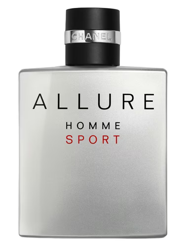  
*4/10*  
Chanel è l'unico brand di lusso che il tuo cervello limitato riesce a riconoscere e hai scelto la versione "Sport" perché vuoi proiettare l'immagine dell'uomo dinamico, fresco, che "ha la situazione in pugno", in pugno hai solo il tuo cazzo minuscolo. Sei un tipo tremendamente noioso che non rischia mai, che sceglie sempre la via più sicura, un groviglio di mediocrità e conformismo. Investimento sicuro per una vita piatta.

**PACO RABANNE Invictus**  
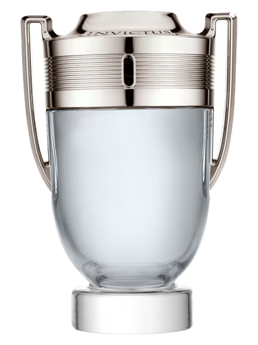  
*4/10*  
Un trofeo di plastica per una dignità di cartone.  
Con una media campionaria di 16,25 bugie al giorno, tu sei un bastardo e Invictus si aggiudica quasi il podio nella classifica dei profumi per uomini bugiardi. Sei un ragazzetto che vive in una perenne fase di negazione della realtà. La boccetta a forma di trofeo è l'unica coppa che vedrai mai nella tua vita. "Gymbro" che passa più tempo a guardarsi le vene dell'avambraccio che ad allenarsi davvero. Odori di schiuma da barba economica, urli "voglio essere notato ma non ho nulla di interessante da dire". Sei un manipolatore di basso livello, usi l'aggressività e il rumore per nascondere che, tolto il profumo e la maglietta attillata di due taglie più piccola, rimani un pirla che ha paura degli insetti. Sei quello che commenta "alpha" sotto i video motivazionali di gente che è finita in prigione.

**GIORGIO ARMANI Stronger With You Intensely**  
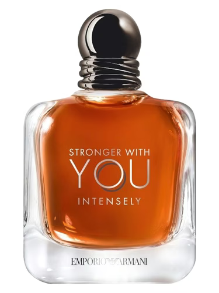  
*8/10*  
Re indiscusso del love bombing. Sei quel tipo di manipolatore sentimentale che ti scrive le canzoni e forse le carica pure su Soundcloud e ti dice che sei unica e diversa dalle altre dopo tre giorni, per poi sparire nel nulla as usual.   
Usi questo profumo perchè hai proprio bisogno di nascondere il retrogusto mortale della tua incapacità assoluta di assumerti una responsabilità. Sei emotivamente parassitario, ti nutri dell'attenzione altrui come un buco nero, sei quel "bravo ragazzo" di facciata che in realtà è un abisso di insicurezza. Zucchero filato per predatori emotivi.

**PARFUMS DE MARLY Herod**  
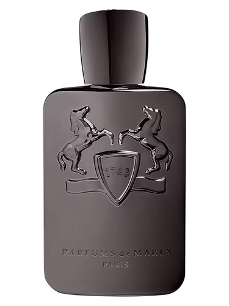  
*9/10*  
Sei ricco sfondato. Bellissimo. Bastardo. Manipolatore è dire poco. Tu la preda te la studi anche per mesi da lontano, per avvelenarla per bene. Lavoreresti ancora meglio… se fossi meno pick me.

**DIOR Fahrenheit**  
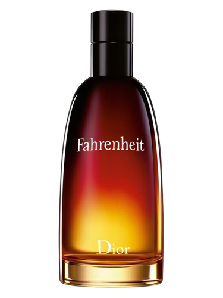  
*7/10*  
Ti senti un poeta maledetto che vive ai margini della società. In realtà sei solo un pirla irritante che passa troppo tempo nei bar a spiegare perché "la democrazia è fallita". Odori di un desiderio disperato di essere considerato "diverso".   
Sei il manipolatore che usa il mistero per nascondere che non ha un lavoro stabile e che vive ancora con i genitori.   
La tua "oscurità" è profonda quanto una pozzanghera dopo un temporale.   
Sei un clochard di lusso che è convinto che le ragazze penseranno che hai un'anima tormentata.   
Amore… pensiamo solo che hai bisogno di uno shampoo.

**GUCCI Guilty pour Homme**  
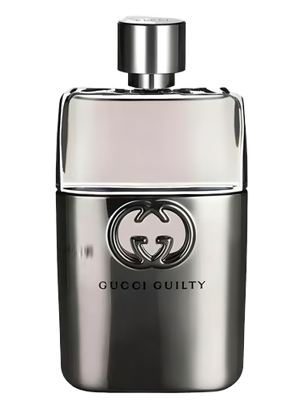  
*2/10*  
Sei noioso. Sei noiosissimo. Fai qualcosa, ti prego. Non ti sopporta più nessuno.  
E poi devi smetterla di bere la birra, davvero.   
Dire "Voglio una rossa" alla cameriera tinta non te la farà rimorchiare MAI.

**PARFUMS DE MARLY Althaïr**  
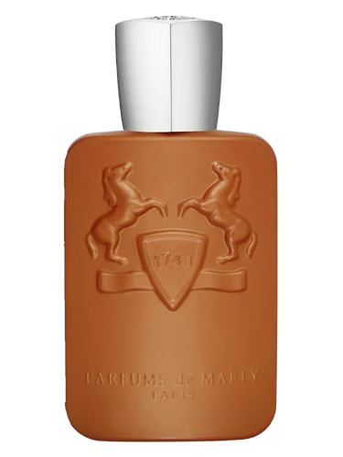  
*10/10*  
*" È per te, per te, perdutamente*  
*Che farei dell'impossibile e dei sogni, la realtà*  
*E dei miei pensieri sei tu il punto fermo*  
*Sei nel cuore oppio, fuoco e ossigeno*

*\[...\]*

*E del tutto follemente, il mio mondo è per te*  
*Sei nei miei pensieri e nei desideri*  
*Come nel DNA*  
*Quando tu non ci sei sei nell'aria che respiro*  
*Sei nel cuore oro, luce e ossigeno "*

Le mie parole, per questo profumo, non sarebbero bastate.

**LV Imagination**  
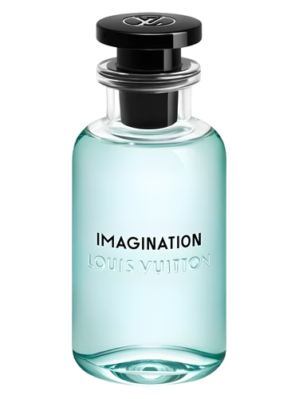  
*9/10*  
Non sapevi come spendere i soldi (non tuoi) e hai scoperto che esistono anche i profumi da uomo.   
Poi dopo un mese hai scoperto che esistono anche di Louis Vuitton, e ovviamente non sapendo un cazzo hai trovato lui.   
Imagination. Buonissimo, tralaltro. Forse il mio LV preferito.  
Che tiktoker ti ha mandato alla Rinascente a comprarlo con la tua American Express in negativo?

**LV L'Immensité**  
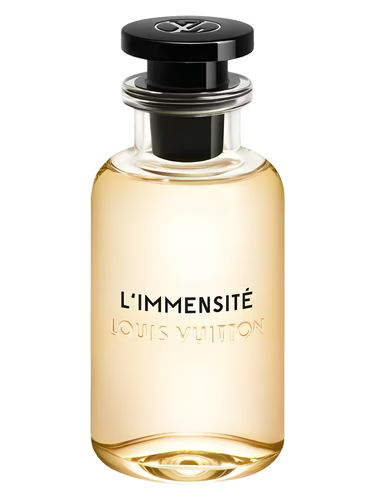  
*8/10*  
Piacione. Frizzante, fresco, ma molto anonimo; hai il ciuffo gellato e la permanente riccia.   
Devi imparare a farti la barba, non ti si può vedere così, davvero. Ah e basta col caffè,   
o tra due anni devi fare le faccette ai denti.

**JEAN PAUL GAULTIER Le Male Elixir**  
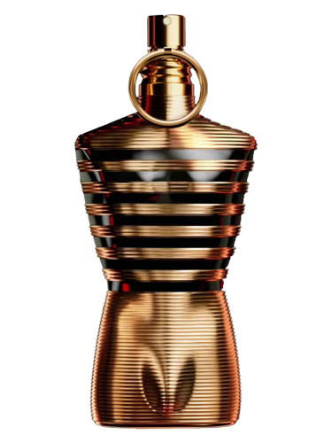  
*5/10*  
Il pavone da palestra. TAMARRO. Sei ossessionato dal tuo corpo al limite del patologico. Personalità che ha lo spessore di un foglio di carta velina. Hai bisogno di essere rassicurato costantemente.   
Sei un manipolatore infantile, fai i capricci se non sei al centro della scena e usi qualsiasi cosa ti capiti a tiro come arma di ricatto.

**GUERLAIN L'Homme Idéal**  
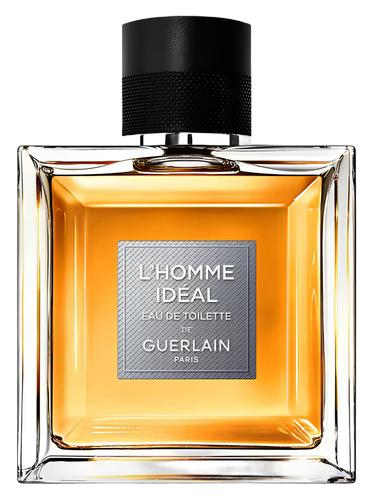  
*6/10*  
Narcisista smisurato. Pensi di essere intelligente, sofisticato e profondo. Spoiler: nessuno dei precedenti. Sei quello che rigira ogni conversazione a suo favore, che ti fa dubitare della tua stessa memoria pur di non ammettere di aver torto. La tua raffinatezza è una maschera di plastica e sotto c'è un uomo piccolo, ossessionato dall'immagine di perfezione che proietta, terrorizzato dal fatto che qualcuno scopra quanto sei mediocre. Una buona versione olfattiva di un profilo LinkedIn gonfiato.

**HERMÈS Terre d'Hermès**  
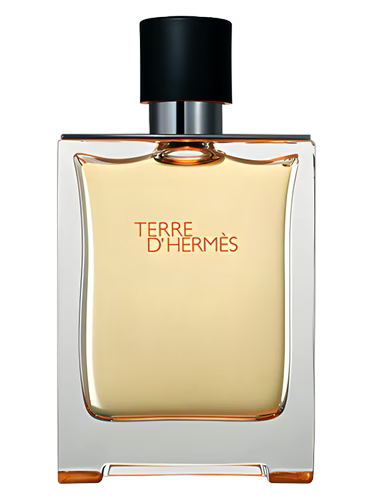  
*7/10*  
Se lo indossi sotto i 50 anni hai una patologia che chiameremo "complesso di superiorità non giustificato".   
Fai mansplaining anche su come si respira.   
Hai una mente vecchia, rigida e priva di qualsiasi apertura verso il mondo moderno.   
Sei manipolatore nel senso più autoritario del termine. Pensi che la tua opinione sia legge e tratti chiunque non la pensi come te come un povero ignorante. Sei l'uomo che non chiede mai scusa, quello che "io sono fatto così, prendere o lasciare", sperando che qualcuno sia così disperato da prendere. Sei emotivamente arido come il deserto che cerchi di evocare.

**PACO RABANNE 1 Million / 1 Million Elixir**  
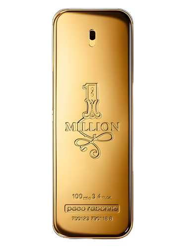
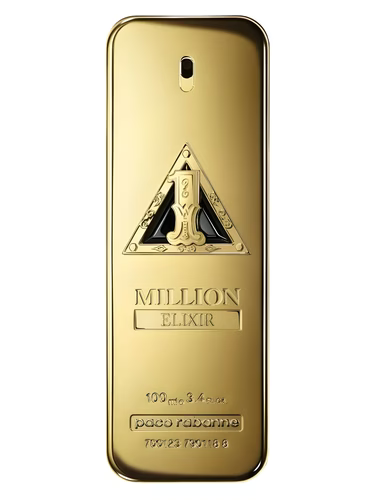  
*5/10*  
Sei un coglione totale. Cafone e rumoroso. Tamarro come pochi. Hai un debito con la findomestic per le rate della macchina usata che guidi come se fossi in Fast & Furious. Ti prego togli l'highlight "me" dal profilo e cambia scarpe, hai le stesse AF1 da un decennio.

**PACO RABANNE Phantom**  
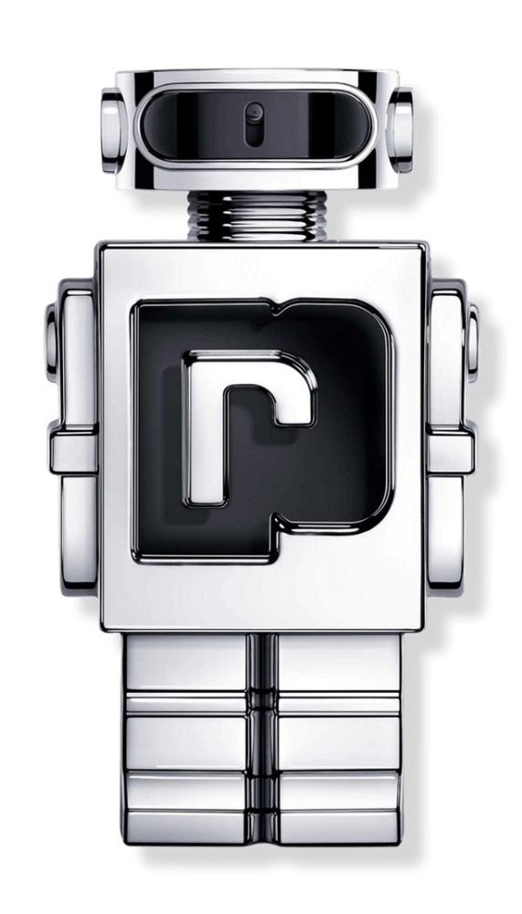  
2/10  
Non hai un singolo pensiero originale. Sei manipolabile da chiunque abbia un minimo di carisma perché sei un guscio vuoto che cerca di riempirsi con estetiche futuristiche ridicole. Sei il tipo che segue i "consigli per rimorchiare" su YouTube. La tua boccetta è un giocattolo esattamente come la tua dignità.

**GUCCI The Heart of Leo**  
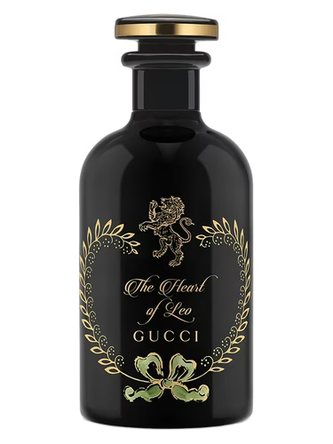  
*10/10*  
Fai di me ciò che vuoi\!

**DIOR Homme Intense 2011 / Homme Intense 2025**  
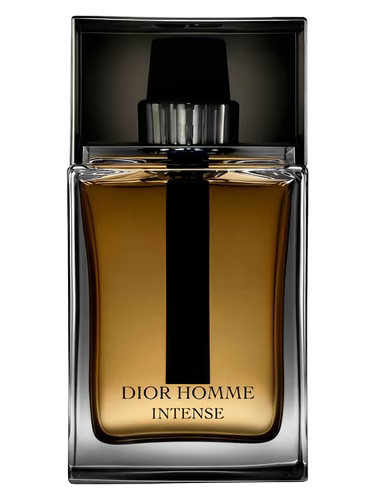
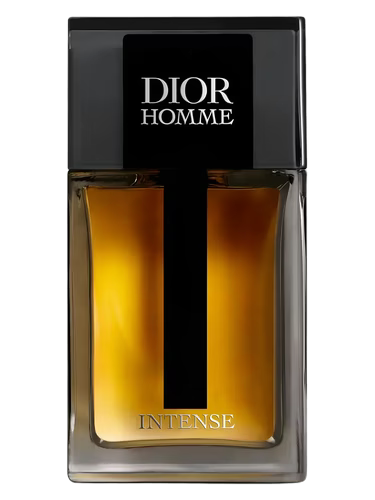  
*10/10*  
Raffinato. Sembra un uomo sensibile e intelligente, quasi uno che piange guardando i film. Cazzate. Ti fa abbassare le difese poi ti distrugge con una precisione chirurgica. È il tipo che ti fa sentire l'unica che lo capisce veramente per poi dirti che sei pazza quando chiedi coerenza. Elegante, parla bene, veste bene… ma *sotto l'odore di rossetto costoso* c'è amianto puro che non esiterà a sacrificarti per il suo ego. Uomo nero vestito da principe azzurro, fr. Scappare. E lo dico consapevole che è uno dei miei profumi preferiti.

**PARFUMS DE MARLY Layton**  
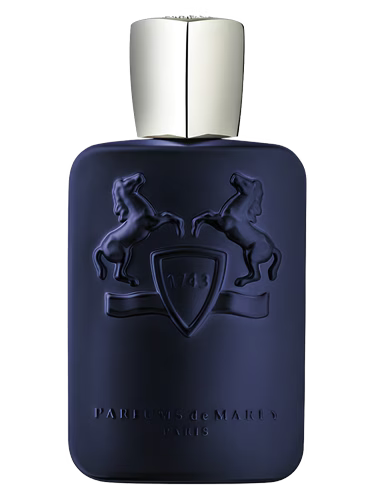  
*10/10*  
*" E ritorni così, nel mio mondo così, imprevedibile*  
*Mi riavvolgi di te, ti riappropri di me*  
*Di me che sono pioggia senza nuvole,*  
*Orologio senza tempo, tuono senza fulmine,*  
*Senza di te*  
*Dimmi chi sei*  
*Nel tuo ritorno*  
*Un verso in cerca di poesia*

*\[...\]*

*Un suono in cerca di armonia*  
*O forse tu sei*  
*Una lontana nostalgia*  
*Di un sogno andato via "*

Di nuovo, le mie parole, per questo profumo, non sarebbero bastate.

**LALIQUE Encre Noire**  
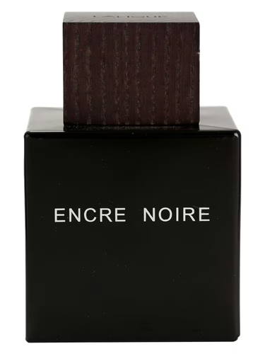  
*6/10*  
L'edgy dei poveri. Il "finto depresso" che ha fatto della tristezza la sua intera personalità perché non ha nient'altro da offrire. Vuoi disperatamente sembrare un "artista tormentato". Sei un manipolatore affettivo che usa la sua presunta malinconia come esca per attirare donne con la sindrome della crocerossina.   
Sei quello che "Scusa se non ti ho risposto, mi ero perso guardando il cielo", poi si scopre che stavi rankando su LOL. Sei pesante, lugubre. Un trauma noioso e evitabile, non sei da curriculum.

**YVES SAINT LAURENT Y / Y Eau de Parfum**  

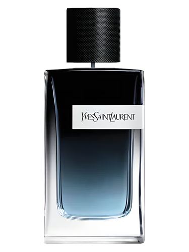  
*7/10*  
Sei il tipo che pensa che la mascolinità si misuri in base a quante volte riesci a interrompere una donna mentre parla. Usi la forza, il rumore e l'intimidazione per ottenere quello che vuoi. Hai problemi a gestire la rabbia se qualcuno ti sorpassa in autostrada.

**AMOUAGE Interlude Man**  
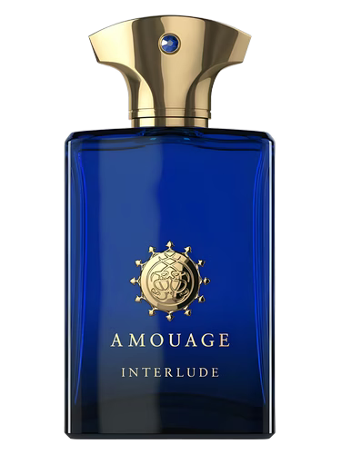  
*6/10*  
Il dittatore. Chi indossa questo profumo non cerca consensi, cerca sudditi.   
Egocentrico di proporzioni bibliche che vuole letteralmente asfissiare chiunque si trovi nel raggio di 10 metri.   
Vuoi che tutto ruoti intorno a te, alle tue regole e ai tuoi ritmi. Non accetti critiche, non accetti compromessi. Delirio di onnipotenza fatto a profumo.

**YVES SAINT LAURENT MYSLF**  
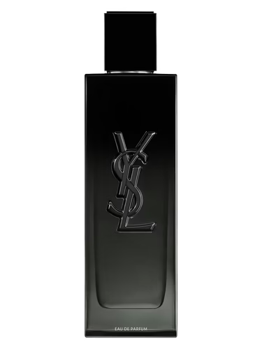  
*9/10*  
A me questo profumo tristemente piace da matti. So che è per i manipolatori nabbi ma mi piace. E sono confident nel dire che se lo usi sei anche un solid 8/10 ALMENO\!

**DIPTYQUE L'Eau Papier**  
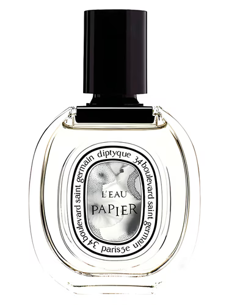  
*10/10*  
Whatever you say, handsome.

**TOM FORD Oud Wood**  
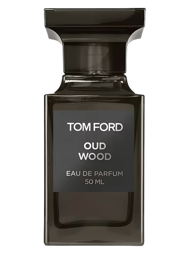  
*6/10*  
L'aspirante magnate che vive di apparenze. Pensi davvero che questo profumo basti a darti un'aura di potere e autorità?   
Usi il gergo aziendale anche a letto e valuti le persone in base al loro potenziale di utilità. Sei ossessionato dallo status e dal controllo, ma sotto quella coltre di sintetico sei un uomo terrorizzato dal fallimento e dal giudizio altrui. Sei quello che compra i libri di crescita personale per lasciarli sul comodino e farsi vedere acculturato. Sei freddo, calcolatore. Sei un mobile di design scomodo, bello da vedere (forse… ho dubbi anche lì), incubo da avere in casa. Capitalismo olfattivo.

**GIORGIO ARMANI Acqua di Giò**  
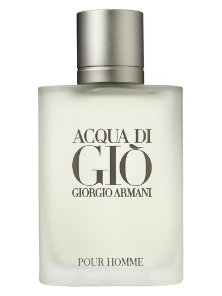  
*7/10*  
Il profumo di tuo (e mio) padre, o di un uomo che ha smesso di evolversi quando è caduto il Muro di Berlino. Sei l'uomo sicuro, quello noioso. Manipoli per le circostanze, ti piace fare il trattamento del silenzio, ma spesso e volentieri ti limiti a esistere, sperando che qualche crocerossina ti scelga per la tua "stabilità" che, spoiler, non ESISTE. Sei l'antisesso.

**TOM FORD Ombré Leather**  
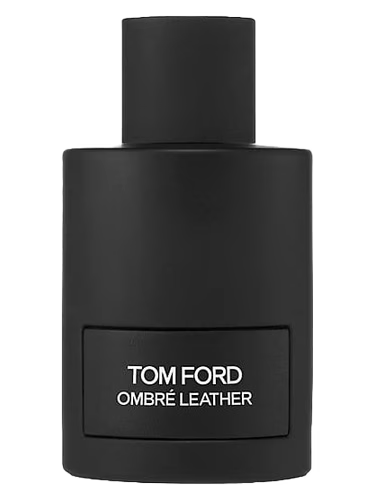  
*8/10*  
Bombo.  
Peccato che lo indossano solo ragazzetti che sono terrorizzati all'idea di sporcarsi le mani con le uova e la farina insieme. Un uomo rude, tutto cuoio e mistero??? Cazzata, sei un insicuro che ha bisogno di un odore da duro per nascondere che piangi se ripensi alla friendzone delle medie. Forse sei pure fregno, ma dopo dieci minuti di conversazione si capisce che il cuoio è l'unica cosa profonda che hai.

**MAISON MARGIELA Jazz Club**  
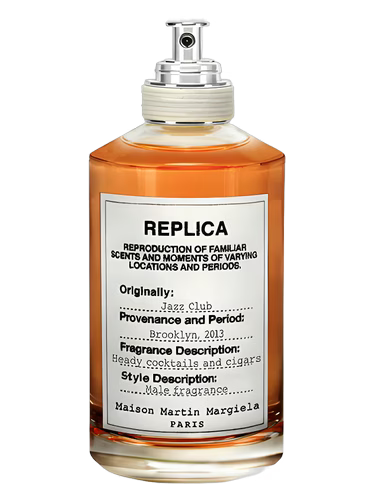  
*9/10*  
Profumo buono da togliere il fiato, ma tu sei una testa di cazzo, sei un rompipalle, edgy performativo, bastaaaaa, hai rotto i coglioni a tutti e nessuna ti vorrà mai davvero dopo averti visto i repost.

**LE LABO Gaiac 10 Tokyo**  
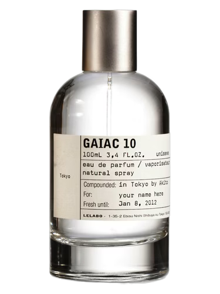  
*9/10*  
Mai avuto una relazione. Innamorato della stessa tipa da 5 anni. Lei intanto vive tranquillissima. Tu hai cambiato capelli 10 volte e ti fai comunque cagare. Cultore dei profumi, però; bravo. Sei autistico by any chance?

**PENHALIGON Fortuitous Finley**  
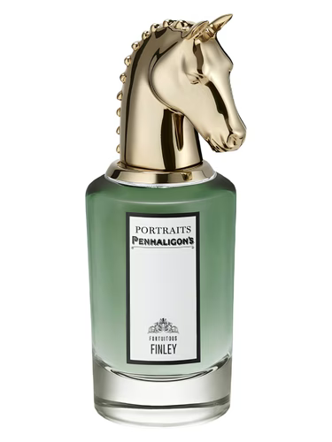  
*10/10*  
Cosa devo fare per conquistarti? I'll go the long way, no joke.

**PHLUR Father Figure**  
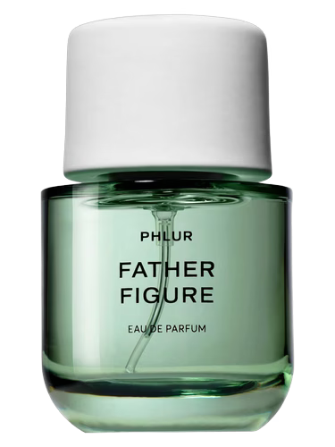  
*9/10*  
Sarebbe unisex, ma lo metto qui. Comunque, chiunque lo indossi, ha diritto a un posto vicino a me in un letto. E non per il nome.

**GUCCI Guilty Absolute**  
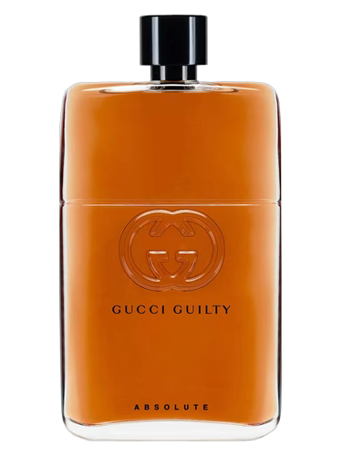  
*9/10*  
Davvero buono. Sulla pelle di un uomo è incredibile. Il problema è che sei un uomo di merda. Mi fai paura. Non è una paura bellissima, è decente, cioè, non penso che tu sia degno di rispetto ecco, però il profumo ti fa fare bella figura. Alle medie avevi il casio. Hai rotto il cazzo con le foto di te che vai in montagna BRO NOBODY GAF POST BICEPS OR BACK PICS IDK

**CAROLINA HERRERA Bad Boy**  
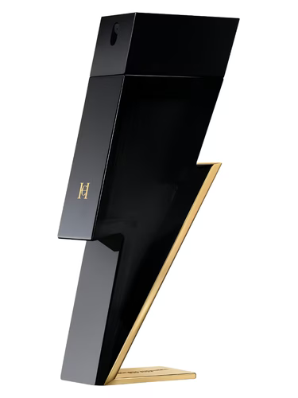  
*7/10*  
Ti svegli? Ma quand'è che ti svegli?

**YVES SAINT LAURENT La Nuit de l'Homme**  
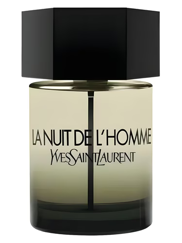  
*9/10*  
Mi piace perchè non urla ed è elegante, ha un che di raffinato. Moooolto womaneater. Grazie a dio non sei tamarro. Però devi essere all'altezza della scia paradisiaca che porti, I mean, non posso sentire questo profumo girarmi e vedere un ratto unto…

**JEAN PAUL GAULTIER Le Male Parfum**  
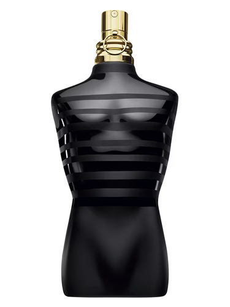  
*8/10*  
Mi vergogno a dire che mi piace, però si, mi piace. Quanto a te sei problematico, devi trovare una cura ai tuoi complessi, e smettila di riversare la tua rabbia sulle minorenni (spoiler: uniche che riesci a rimorchiare con le tue tattiche). Fingi una maturità che non possiedi assolutamente. Sei quello che ammazza e poi dice "Perchè sei così sensibile?".

**ORTO PARISI Megamare**  
  
*7/10*  
Non siamo nemmeno più di fronte a un profumo, ci stiamo proprio sedendo davanti ad un disturbo antisociale di personalità liquido. Direi uno che gode nel dominare lo spazio fisico degli altri senza permesso, la versione olfattiva di un predatore che marca il territorio col piscio, ma lo fai con una molecola che non va via neanche con l'acido solforico. Hai bisogno di urlare per esistere. Hai pochi modi di entrare nelle vite degli altri e questo profumo è una di quelle. Sei tossico nel midollo, hai bisogno di una perizia psichiatrica prima di una signature scent.

**M. MICALLEF Notorious XO**  
  
*10/10*  
SOOOO FUCKING SEXY. Se solo non fossi così cazzo pieno di te, mamma mia.

**HUGO BOSS Bottled Absolu**  
  
*8/10*  
Buonissimo. Riguardo a te invece, sei un aspirante sociopatico. L'evoluzione del "Boss" originale, il che significa che sei ancora più arrogante (e interessante, però). Cerchi un'aria di autorità e spiritualità oscura, hai manie di grandezza. Tratti le relazioni come contratti da ottimizzare e le persone come asset da sfruttare. Sei freddo, cinico e sogni una collezione di orologi, che sicuramente varrebbe più della tua onestà intellettuale. Se una donna ti frequenta è solo perché spera che tu sia ricco quanto cerchi di apparire; spoiler: finirai indebitato fino al collo per mantenere un'immagine che non ti appartiene.

**ISSEY MIYAKE Le Sel d'Issey**  
  
*8/10*   
Egoista travestito da monaco. Il manipolatore "Zen" (o presunto tale). Vuoi proiettare l'immagine dell'uomo equilibrato, minimalista, connesso con la natura e privo di vizi. Sei un blocco di ghiaccio emotivo. Quello che sparisce appena si stanca di dover gestire le emozioni di un altro essere umano. Passivo-aggressivo ai massimi livelli.

**VIKTOR & ROLF Spicebomb**  
  
*6/10*   
"Guardatemi, esisto!". Che ridere, se ti avessi davanti a tutti i tuoi mansplaining risponderei come si risponde ai bambini che dicono cazzate. Sei rumoroso, caotico e profondamente invadente. Non hai il minimo concetto di spazio vitale altrui: tu entri in un posto e devi saturarlo, come se stessi marchiando il territorio. Ottieni attenzione facendo confusione, provocando reazioni forti perché non sai come generare interesse reale. Sei il tipo che fa battute fuori luogo, che ride troppo forte e che pensa che "essere un personaggio" sia un sostituto della personalità.

**VIKTOR & ROLF Spicebomb Extreme**  
  
*7/10*  
Uguale a Spicebomb, meno l'incapacità di gestire situazioni e relazioni sociali. Hai i tuoi limiti, ma sei comunque invadente a modo tuo; fai double texting a quelle che non ti rispondono e non caghi le poverette che ti vanno dietro da 3 anni (dipendenza affettiva data da traumi, tranquillo, non è merito tuo o del tuo fascino).

**XERJOFF XJ 1861**  
  
*10/10*  
Molto buono il profumo. Tu sei un rompicoglioni, però. Good news though, nel tuo manipolativo tentativo di conquistare le ragazze, sborsi un casino di soldi e passi per il provider man del secolo. Voi altre sfruttate finchè si riesce, tanto le corna ve le fa lo stesso.

**L'ERBOLARIO Ginepro Nero**  
  
*2/10*  
Questo profumo fa vomitare e tu anche. Innanzitutto, non sai neanche cosa significa trattare bene una ragazza; imiti, ci provi, segui uno stereotipo per fare cose in cui nemmeno credi, perchè non sei in grado di amare genuinamente. Sei orgoglioso (chissà di cosa), narcisista, non ti interessa davvero di niente se non di te stesso; non vuoi nemmeno bene a tua madre, i tuoi genitori molto probabilmente sono separati e tu l'hai sofferta ma non lo ammetti perchè fa character development. Peccato che su di te non abbia portato neanche un briciolo di positivo, l'indipendenza post divorzio dei tuoi. Sei solo cresciuto storto e incapace.

**ADIDAS Chill Zone**  
  
*3/10*  
Sei l'equivalente umano di un bicchiere di cola lasciato sgasare al sole. Privo di sostanza e vitalità una volta passata l'effervescenza chimica. È il profumo di chi ha trasformato la propria igiene personale in una pratica burocratica: "Ho fatto la doccia? Sì. Ho messo qualcosa? Sì." Fine della personalità. Hai talmente paura di essere giudicato per i tuoi gusti che hai deciso di non averne. Sei intrappolato in una zona di comfort che in realtà è una palude di stagnazione emotiva.

**CALVIN KLEIN CK One / CK One Essence**  

  
*2/10*  
Il classico profumo che ti regalano a Natale quando non sanno cosa darti e sanno solo che nelle mutande hai il pacco. Se indossi CK One con consapevolezza, però, io non sarei così sicura nemmeno di quello. Forse qualche tempo fa eri anche tentato di cliccare sugli annunci che vendono le pillole per ingrandirlo. Prendi qualche kg, vai in palestra, e capisci che non PUOI fisicamente fare il figo se nel mentre odori di pozzanghera acida.

**GIORGIO ARMANI Acqua di Giò Profondo**  
  
*8/10*  
Di questo profumo ti ci vanti molto. Troppo. Infatti appena lo metti, l'ego che hai già alle stelle si alza a livelli che farebbero tremare qualsiasi psicanalista. Sei un figo, però, su questo non ci piove. Dovresti lavorare di più sul fatto che, a un bel viso e a un buon profumo, per far funzionare la manipolazione dovresti abbinare un po' di cervello. Fai girare gli ingranaggi ogni tanto.

**GIORGIO ARMANI Acqua di Giò Profumo**  
  
*9/10*  
Quello normale era troppo da ragazzino, vuoi sembrare un uomo che ha visto tempeste e segreti inconfessabili, l'unica tempesta che hai vissuto è stata la scelta tra il leasing di una Serie 1 o di una Classe A. Sei il tipo che finge di essere impegnato e non risponde per ore, tempo in cui, in realtà, doomscrolli sperando che la dopamina dei reel/TikTok ti dia quello che ti manca e non sai chiedere. Emotivamente arido come gli scogli su cui ti fai fare le foto in camicetta e khaki per Instagram, peccato che lo scoglio abbia più carisma. Stai ancora piangendo perchè la ex storica non ti ha mandato gli auguri di Buon Anno. Il profumo è buonissimo, un capolavoro; il problema siete voi utenti, che è come mettere una corona a un impiegato del catasto.

**VALENTINO Born In Roma Uomo**  
  
*8/10*  
Il pretty-boy per eccellenza, passi tre ore a capire come metterti in posa nelle foto per sembrare sia ricco che misterioso e nel contempo fare anche vedere la jawline, non ti sai allenare, vuoi sembrare trasgressivo. La tua autostima dipende quasi interamente da quanti soldi riesci a rubare ai tuoi o da quante tipe ti guardano. Spesso e volentieri sei scontato o una noia mortale. Però sei un figo! Ah e soffri di un ENORME complesso di inferiorità.

**VALENTINO Born In Roma Uomo Intense**  
  
*10/10*  
Vorrei dire delle orribili cose sul tuo conto perchè te le meriti tutte, sei un pazzo maniaco malato manipolatore, però sfortunatamente mi piaci e questo profumo me lo inietterei nelle vene. La tua manipolazione è raffinata, non nel senso che sai davvero quello che stai facendo, ma nel senso che ti studi la vittima in maniera precisa. Sei bravo a nascondere la tua tossicità dietro un velo di dolcezza asfissiante, narcisista covert.

**VALENTINO Born In Roma Uomo Extradose**  
  
*9/10*  
Siamo all'incirca sulla stessa linea dei fratellini, con l'aggiunta che tu sei un pochino più tamarro. Di quelli che alzano il volume della radio a 70 con 4 passeggeri a bordo e una P sul lunotto.

**MONTALE Intense Cafe**  
  
*2/10*  
Segnale di narcisismo vulnerabile mascherato da sensibilità. Quello che vuole sembrare dolce, "edible" (come dicono quei video suggestion di fragranze imbarazzanti), sei un manipolatore pigro. Abbassi le difese delle tue prede fingendo di essere un uomo moderno che non ha paura del suo lato femminile. In verità sei un predatore di attenzioni che non sa gestire un rifiuto. Sei quello che, dopo un appuntamento andato male, manda messaggi passivo-aggressivi perché "non hai apprezzato la mia profondità". Amore è che non apprezzavano il diabete di tipo 2 che gli hai causato stando seduto vicino a loro.

**MANCERA Instant Crush**  
  
*10/10*  
Ti amo. Ma solo dopo che spariscono quelle note di apertura da brividi. Quei primi 3 minuti sono un TSO olfattivo poi, però, arriva la magia ed è lì che diventi pericoloso. Narcisista overt "beast mode". Non spruzzi un profumo, dichiari una guerra coloniale allo spazio vitale altrui. Se entri in una stanza e qualcuno non si gira a guardarti (anche solo per tossire), il tuo intero sistema di credenze crolla. Il tuo è un attaccamento ansioso e disorganizzato mascherato da iper-sicurezza, sotto quella colata di ambra e sandalo si nasconde la paura atavica di essere invisibile. Hai bisogno di schiacciare l'ambiente circostante per sentirti solido.

**MANCERA Tonka Cola**  
  
*5/10*  
L'odore di chi ha sostituito l'autostima con le calorie. Alle feste di compleanno dei tuoi compagni eri quello che stazionava vicino al vassoio delle pizzette, guardando con odio il festeggiato perché i suoi regali erano meglio dei tuoi. Quell'invidia infantile non ti ha mai abbandonato, oggi si è solo trasformata in un bisogno compulsivo di accumulare oggetti inutili per riempire un vuoto che nessuna bevanda gassata potrà mai colmare. 

**ADIDAS Dream Glaze**  
  
*5/10*  
Sei un caso di disturbo da impulso all'acquisto legato a una profonda insicurezza materiale. Non arrivi a fine mese perché spendi in "cavolate" (gadget, dupe di profumi, cibo spazzatura) nel disperato tentativo di comprare la felicità che ti è stata negata (o che pensi ti sia stata negata) nell'infanzia.

**BVLGARI Man In Black**  
  
*9/10*  
Capolavoro di equilibrio tra brutalità e raffinatezza. Ma restiamo con i piedi per terra: lo indossi perché vuoi proiettare l'immagine dell'uomo "vissuto", quello che ha segreti indicibili e un conto in banca a sei cifre (anche se magari sei solo un consulente finanziario che vive ancora coi genitori). Odore di chi sa esattamente dove seppellire un corpo o dove nascondere una ricevuta fiscale sospetta. Forti tratti di machiavellismo e narcisismo grandioso. Ti piace il controllo, vuoi essere un salvatore oscuro del caos del mondo, come se tu fossi simbolo di fermezza; tieni le persone a una distanza che permette di ammirare la tua "profondità" (tra virgolette non casualmente) senza mai vedere le tue crepe emotive. Non sai connetterti bene con gli altri; o almeno non sentimentalmente.

**ADIDAS Full Recharge / Spark Up**  

  
*2/10*  
Sei "fresco" come l'aria condizionata di un ufficio postale. Artificiale, deprimente e funzionale solo a non far svenire. Nell'ultima fallisci, per fortuna la nube di questo profumo dura 3 secondi. Comunque, un'acquetta che non dice "sono energico", dice "ho smesso di lottare". Sei il ragazzino che non disturba, non attira e non distoglie lo sguardo.

**DIOR Sauvage Elixir**  
  
*8/10*  
Se il Sauvage originale è il paziente zero, tu sei la variante Delta potenziata in laboratorio. Sei il boss finale della manipolazione. Non ti accontenti di dare fastidio, tu vuoi dominare la chimica cerebrale di chiunque entri nel tuo raggio d'azione. In teoria sei un uomo di potere, o almeno, hai imparato a simularlo così bene che ormai ci credi anche tu. Sei freddo, calcolatore, e probabilmente hai un piano quinquennale anche per decidere cosa mangiare a colazione. La tua è una tossicità d'élite, non urli, sussurri minacce velate dietro un muro radioattivo. Sei quello che non chiede scusa perché "i leader non si spiegano". Sei un dittatore letale come un virus.

**TOM FORD Tobacco Vanille**  
    
*8/10*  
Old Money fan eh?. Sei convinto di odorare come un club privato londinese degli anni '20 ma per il 90% delle persone, di quelle che hai intorno TU, odori di pacchetto di sigarette dimenticato in un cassetto unto. Compri libri di filosofia che non leggi e guardi film in lingua originale senza sottotitoli solo per poterlo dire a cena. Ovviamente poi non sai spiegarli e ti inventi le parole che hai letto a caso su un commento di Letterboxd. Usi la tua "raffinatezza" come un'arma per far sentire gli altri inadeguati. In realtà, sei un insicuro che ha bisogno di un marchio costoso per sentirsi autorizzato a parlare.

**JEAN PAUL GAULTIER Ultra Male**  
    
*7/10*  
Il predatore da discoteca in perenne arresto di crescita. Sei un uomo di 30 anni intrappolato nel corpo di un ragazzino di 17 (o viceversa!) che ha appena scoperto che può rimorchiare offrendo shot di tequila scadente. Odori di un mix che urla "non ho intenzione di prendermi cura di te, ma voglio che tu ti prenda cura del mio ego per le prossime due ore". Sei quello che fa i TikTok in palestra. La tua maturità emotiva è paragonabile a quella di un tamagotchi abbandonato.

**XERJOFF Torino21**  
    
*6/10*  
Sei il riflesso biondo platino del narcisismo. Pensi che spendere 250€ per un profumo ti renda automaticamente un semidio mediterraneo. Sei quel tipo di manipolatore che ti riempie di attenzioni per farsi dire quanto è bravo, bello e speciale. Se qualcuno non apprezza la tua "aura" lo cancelli dalla tua vita con la stessa velocità con cui carichi un post su Instagram per far vedere che sei in un posto esclusivo.

**LATTAFA Asad / Asad Bourbon / Asad Zanzibar**  


  
*2/10*  
Se hai letto le recensioni delle donne per i profumi LATTAFA, avrai sicuramente notato una vaga somiglianza nella bottiglietta della linea Yara. Infatti si merita lo stesso trattamento. Vuoi essere un predatore ma hai il budget di un tirocinante non pagato, l'incarnazione del "vorrei ma non posso", un mediocre che cerca di spacciarsi per qualcuno di importante usando una copia carbone, il tipo che parla di "mindset da milionario" mentre controlla se ha abbastanza soldi sulla PostePay (carta non casuale) per il kebab. La tua intera identità è un dupe di qualcosa di reale.

**JEAN PAUL GAULTIER Le Beau Paradise Garden**  
    
*5/10*  
Sei talmente convinto di essere rilevante che quasi mi dispiace rovinarti i vestiti, ma tanto non arriverai a leggere la fine di questo paragrafo: la tua soglia di attenzione è stata incenerita dai reel sulle "strategie di investimento" di ragazzini in Dubai e dai video di calcio con la musica trap in sottofondo. Sei il manifesto del bimbo di legno tropicale. A volte, in un raro guizzo di lucidità, pensi di voler diventare padre; è l'unico momento in cui il tuo cervello processa un dato reale, perché realizzi che la tua intera utilità biologica si riduce alla funzione di un mero distributore automatico di materiale genetico. Il tuo sistema nervoso è tarato su stimoli di 15 secondi; oltre quel limite, subentra il vuoto pneumatico. Cerchi una connessione ma non hai gli strumenti cognitivi per sostenerla, quindi ti rifugi in un odore di cocco e menta che urla "sono fresco e disponibile", sperando che nessuno ti ponga mai una domanda su quello che fingi di sapere.

**JEAN PAUL GAULTIER Le Male**  
    
*6/10*  
Sei l'odore del primo ex di qualcuno, quello che ha lasciato un trauma ma che oggi fa solo tenerezza. Sei prevedibile, rassicurante e profondamente noioso. Usi la lavanda come un sedativo per la tua crisi esistenziale. 

**JEAN PAUL GAULTIER Le Beau**  
    
*7/10*  
Ho VERAMENTE TANTO da dire a te. Il narcisista delle "Good Vibes" che pensa che una foglia di fico sul pacco (della boccetta e basta, spero) sia un manifesto filosofico. Sei convinto che basti odorare di buono per essere considerato un Adamo nel paradiso terrestre ma sei un ragazzetto che va in palestra 3 volte a settimana e passa il resto del tempo a editare le foto dei suoi bicipiti per qualche scema con la Iqos. Sei la versione tarda di Le Beau Paradise Garden, almeno tu non fingi di essere un investitore di Dubai, sei un failed gym rat che sogna Formentera tutto l'anno. Esisti solo attraverso lo specchio. Se non ci fosse Instagram, la tua autostima evaporerebbe più velocemente delle note di testa di questo profumo. Un corpo scolpito che ospita "un'anima" con la complessità di un sasso. Forse il sasso è più complesso anzi, per tutta quella retorica che forse se lo tocchi si indurisce... hai presente? Facciamo un `leBeau_kernel_patch.c`.

```
void protocol(user *u) {
    u->shirtless = TRUE;
    u->cognitive_load = 0.01; // risparmio energetico per i bicipiti
    u->personality_depth = 0.5f; // floating point per gestire l'infinitesimo
    while (u->is_observed || u->at_gym) {
        // ciclo infinito di auto-validazione
        check_abs_in_mirror();
        // la dose deve essere tossica per l'ambiente circostante
        apply(LE_BEAU, DOSAGE_MAX);
        if (girl_looks_away) {
            u->ego_crisis = TRUE;
            flex();
            // fallback se il flex non funziona, qui si passa ai social
            post_to_instagram_story(u->abs, "Focus. #Grindset"); 
        } else {
            // se ti guardano (strano?) rovini tutto con le tattiche fallimentari
            u->smirk_intensity = 100;
            cringe_eyecontact(); // quello sguardo TROPPO lungo che ammazza qualsiasi cosa
        }
    }
}
```
Quel `while(u->gym)` è la prigione dorata. Non uscirai mai da quel loop, perché fuori dal riflesso di uno specchio, il tuo intero file di sistema restituisce un `NULL POINTER EXCEPTION`. E per la cronaca, ho usato un valore di 0.01 per `cognitive_load` e matematicamente è corretto ma informaticamente quel valore è troppo alto per l'hardware a disposizione quindi dovrebbe essere un unsigned char castato a zero perché la memoria volatile di un utente Le Beau non ha spazio per i decimali. Poi, per fare ancora più i precisini, la condizione di uscita dal while non ha un break perchè se il poveretto si vede nel riflesso flexa finchè non schiatta. It's a feature, not a bug! Una patch 1.1 avrebbe la gestione della donzella con la Iqos:

```
if (target_has_iqos && u->smirk_intensity == 100) {
    u->perceived_charisma = (float)rand() % 2; // Valore random tra 0 e 1, solitamente 0
    execute_failed_pickup_line("Ma è al gusto menta?");
}
```

Per giustificare quel 0.5, dobbiamo applicare il Principio di Esclusione di Yogurt (io): due pensieri intelligenti non possono occupare lo stesso cervello se è già presente una nota di cocco sintetico di Gaultier. $$ \Psi_{LeBeau} = \lim_{\text{IQ} \to 0} \left( \frac{\text{Volume Bicipiti} \cdot \text{Storie IG}}{\sqrt{\text{Libri Letti} + \epsilon}} \right) \cdot e^{\text{Cocco}} $$

Dove abbiamo che $\epsilon$ è una costante infinitesimale che rappresenta la probabilità che tu abbia letto almeno il manuale delle istruzioni della creatina e $e^\text{{Cocco}}$ il fattore di crescita esponenziale dell'illusione di essere attraente; quindi più profumo indossi più la tua percezione della realtà si distorce.

**YVES SAINT LAURENT MYSLF L'Absolu**  
    
*5/10*  
Stammi alla larga tu sei spaventoso e pericoloso e NON ti sopporto.

**JEAN PAUL GAULTIER Scandal Pour Homme**  
    
*8/10*  
Il re del "Guardatemi o muoio", "Ti prego, dimmi che valgo qualcosa". Mettere una corona su una boccetta di profumo al caramello salato è la mossa di marketing definitiva per attirare i soggetti con deliri di grandezza. Sei molesto, rumoroso e la tua presenza satura l'aria. Sei proprio come un pugno in faccia. E ti senti anche tu stesso un pugile sul ring della vita, ma l'unico scontro che hai vinto ultimamente è stato quello con il tuo buon gusto, finito per K.O. tecnico al primo round. La dolcezza eccessiva serve a nascondere un'amarezza interiore dovuta al fatto che, fuori dalla tua bolla di fumo e caramello, sei solo una persona comune che non sa gestire il silenzio.

**PINO SILVESTRE Pino Silvestre Original**  
    
*3/10*  
Boscaiolo peloso che sa di conifera, come fai a non amarlo? Però il profumo fa SBOCCARE. Almost certainly a blind buy di un fan del bagnoschiuma. In generale, un pino pungentissimo, mentolato, fortissimo, troppo intenso; mi ricorda un papà. Icona italica. Ma poi, avete idea di quanti flanker abbia generato questo pilastro?

**YVES SAINT LAURENT MYSLF Le Parfum**  
    
*10/10*  
Non ti bastava quello normale? Il fatto che tu debba 'intensificare' è la prova che senti il tuo io svanire. Se l'hai fatto di proposito, hai dei seri, seri problemi di autostima, però ti senti anche Dio. Segui il calcio e ti piace allenarti. Sei molto bello, ma è una bellezza tragica, una facciata barocca costruita su fondamenta di fango. Tendi a provarci per primo con le donne solo perché questo profumo agisce come un esoscheletro psicologico: ti dà l'illusione di un coraggio che non possiedi. Senza quella scia, torni a essere un guscio vuoto, un "nessuno" che evita lo sguardo altrui perché ha paura che la gente scopra il vuoto che nascondi sotto la camicia stretta. La tua sicurezza è una variabile esterna, non è generata dal tuo io, viene spruzzata ogni mattina. Sei come un'auto di lusso senza motore, bellissima da vedere, ma se qualcuno prova a metterti in moto, si sente solo il rumore di una bomboletta spray. Sei un 10/10 visivo ma la tua anima è un errore di compilazione che non verrà mai risolto.

**VERSACE Eros Flame**  
  
*5/10*  
L'odore di chi confonde il bruciore di stomaco con la passione travolgente. Sei la versione "spicy" del tamarro di periferia. Non ti accontenti di essere fastidioso, vuoi essere urticante. Il tuo profumo urla "ho problemi di gestione della rabbia ma cerco di nasconderli dietro un'estetica da amante latino". Sei quello che pensa che discutere animatamente sia "metterci il cuore", quando in realtà stai solo mettendo alla prova la pazienza (e i timpani) di chiunque ti circondi. Sei il re del gaslighting, dai fuoco alla relazione e poi ti lamenti che fa troppo caldo. Il tuo sistema nervoso è un corto circuito perenne tra l'ipotalamo e la tua totale assenza di autocontrollo. Ami intensamente per tre giorni poi diventi un incubo di gelosia e controllo, giustificando tutto con "sono fatto così, sono passionale". No. Sei un incendio in una fabbrica di plastica. Tossico, difficile da spegnere e lasci solo macerie. Altro che "Flame", sei caldo come una stufa difettosa che sta per saltare in aria.

**BYREDO Bal d'Afrique**  
  
*9/10*  
Mi stai sul cazzo in una maniera credo allucinante. Ti credi il re della simpatia, ci fosse mezza volta che fai ridere con una battuta che non colpisca una minoranza. Il problema? Alle donne piaci pure. Forse è il profumo, il responsabile. Hai soldi, te ne intendi di fragranze, sai come camuffarti il personaggio per fittare in vari posti di ranghi diversi; solito camaleonte manipolatore. Non vale la pena usare il tempo per te, perchè tutto ciò che fai è frutto di un passato insicuro tremendamente profondo che ti ha segnato e tuttora descrive lo schifo che hai e che nascondi in modo fallimentare. Io lo vedo.

**NASOMATTO Pardon**  
  
*10/10*  
Mi terrorizzano i ragazzi che ne sanno di profumi di nicchia, perchè vuol dire che oltre a essere narcisisti, sanno anche come attirare le prede. Mi fanno troppa paura. Se hanno i social ancora di più. Altrimenti, uomo dei miei sogni. Poi NASOMATTO è da ricconi quindi... baby come to mama.

**MERCEDES-BENZ Mercedes Benz Club Black**  
  
*6/10*  
Oddio ma sai che? Dopo 20 spruzzate diventi il fidanzato ideale. Un vero peccato per l'esplora Instagram che pullula di OnlyFanser e per la stempia precoce. Stavi ore su Twitch/YouTube a seguire le live di gente che guadagna il triplo di te e rimanevi pure attivo in chat per sentire il tuo nome chiamato dallo sfigato che streamma, però venivi moderato per spam.

**LATTAFA Nebras**  
  
*5/10*  
Sei quella persona che vuole sembrare "di nicchia" o alla moda scaricando la responsabilità della propria aura su un algoritmo di duplicazione mediorientale, quella che indossi con fierezza inspiegabile è una vaniglia diabetica che non accarezza e ti prende a schiaffi con la sua sinteticità fino a farti venire il voltastomaco. Quelli come te sono la prova finale che il capitalismo ha vinto in tutto e per tutto, perchè il desiderio di bellezza è diventato una catena di montaggio di cloni appiccicosi. Fai una doccia, lava via questo Nesquik di plastica, e prova a capire chi sei. Possibilmente dopo aver spento l'Oppo che hai in tasca.

**DIOR Homme Parfum / Homme Parfum (2025)**  

  
*10/10*  
Come potrei dare meno di 10/10? E poi, a una revisitazione di Kurkdjian!? Comunque sia, quasi ovviamente sei la copy-paste dell'uomo che indossa Dior Homme Intense (2011/2025) con l'aggiunta che ti fai il BAGNO nel profumo ogni volta che esci e che hai una filosofia importante con le donne: sempre brutte; le vuoi controllare meglio, quindi sacrifichi il lato estetico pur di avere in mano il loro intero mondo (ah e ovviamente le tradisci).

**PRADA Luna Rossa Carbon / Luna Rossa**  

  
*6/10*  
Il Sauvage per chi ha fatto il liceo classico. Predatore che ha sostituito l'assault rifle con un MacBook Pro. Profumo di chi vuole dominare ma con "educazione", o semplicemente non sei capace e sei naturalmente sottomesso, o di chi corregge la grammatica altrui durante un litigio per sentirsi superiore. Tecnocratico, vuoi proiettare un'immagine di efficienza ingegneristica ma la tua solidità è volatile, se non inesistente. Sei convinto che una vita all'insegna dell'estetica del minimal-tech possa riempire il vuoto di rapporti veri, genuini e spontanei (che non hai mai avuto). Se vai in discoteca, sei uno di quelli che ci va in t-shirt monocolore e jeans semi-stretto a cavallo basso.

**PRADA Luna Rossa Ocean / Luna Rossa Eau de Parfum / Luna Rossa Ocean Le Parfum**  


  
*7/10*  
In questo profumo cerchi quello che ti manca nella vita quotidiana monotona e triste. Vorresti dare un tono intellettuale e sportivo alla tua presenza e cerchi di abbindolare chi confonde il silenzio per saggezza. Non sei mai soddisfatto di ciò che hai e sei convinto di essere molto profondo e "maturo", misterioso e inesplorato... ai miei occhi sei un tizio qualsiasi relativamente pulito e mediocre che reposta troppi reel calcistici sui social. Ah e sei basso, accettalo. Per favore. Ti rendi solo ridicolo a cercare di smentire gli altri.

**PRADA Luna Rossa Black**  
  
*8/10*  
Tu ti senti in Matrix e ti senti di aver preso la pillola rossa, l'unica rivolta che hai guidato non so quale potrebbe essere... quella di scuotere la macchinetta che non ti fa scendere le croccantelle al bacon? Profumo ottimo. Sexy as fuck. Urbano. Misterioso. Tu il "misterioso" lo rendi irresponsabilità sentimentale. Non vuoi davvero essere al centro dell'attenzione, preferisci essere quello che tutti osservano dall'angolo della stanza; speri che qualcuno proietti su di te la personalità che non hai avuto il coraggio di impersonare o costruire; il nero, che è anche il colore più presente nel tuo armadio e che c'è su questo profumo, è l'unico colore che non ti costringe a dichiarare chi e cosa sei. Cosa rimane, piuttosto, di te, quando togli la camicetta stirata?

**PENHALIGON Halfeti**  
  
*10/10*  
Il mio amore per Penhaligon mi vieta di mettere voti più bassi del 10 a quanto pare in tutto questo sito?! Comunque, mi piaci tanto. Cioè mi piace il tuo profumo poi c'è da capire se tu sei un malato manipolatore impazzito (probabile, perchè un uomo che sceglie così bene un profumo mi spaventa). Both cases, I'd fuck.

**DIOR Homme (2020)**  
  
*8/10*  
Alpha corporate mf much? Qui non c'è l'iris, punto importante di svolta per la personalità del profumo; viene sostituito da cosa? Da legno e l'Iso-E Super. Quindi è stata tolta la poesia per metterci efficienza. Il senso si avvicina all'individuo; l'uomo tutto d'un pezzo che in realtà è un puzzle di merda. Non hai mai cercato l'amore come lo intendono tutti, cerchi validazione del tuo status. La fiducia che hai di te stesso confina con la sociopatia. Loop di cortisolo e dopamina da KPI. Irraggiungibile emotivamente.

**DIOR Homme L'Original**  
  
*9/10*  
Icona. Il "Bello e dannato" per eccellenza. Sei sofisticato ma puzzi di complesso di Edipo irrisolto. Vuoi sembrare artistico e, similmente a Homme Intense, abbassi le difese della vittima e ti riveli freddo e metodico solo quando la hai in pugno (il che accade, tralaltro, piuttosto in fretta). Attiri chi cerca la complessità, e questo aiuta la tua convinzione di essere protagonista di un film d'autore francese... bad luck, la tua trasgressione massima è stata tentare di ordinare un cocktail fuori menu. Estrema vittima della mascolinità tossica, infatti il profumo che sa di rossetto te lo spruzzi come un vero alpha (se no diventa gay).

**DIOR Homme Sport (2021)**  
  
*7/10*  
Dei nostri amati Dior Homme questo non ha niente, quindi ci spostiamo proprio su un'altra dimensione rispetto a quelli già visti. Cercando di ignorare la mia generale idea su qualsiasi profumo che contenga "Sport" nel nome, noi qui siamo davanti a un uomo che scappa ogni secondo dalle sue responsabilità emotive. Vuoi sembrare dinamico, diverso, sfortunatamente trapela la tua paura fottuta di invecchiare o risultare irrilevante. Fai sempre qualcosa perchè se ti fermi un attimino a pensare, devi fare i conti con il vuoto abissale che sei dentro. Restare fermo significa essere scoperto. Stai sempre, sempre, sempre a performare, per un pubblico reale o immaginario (il massimo sforzo mentale che riesci a fare è proprio quello di creare questo pubblico). La trilogia di Dior Homme è la storia di un uomo che si sta smontando: l'Original cercava di essere un artista, il 2020 ha deciso di essere un dirigente e lo Sport sta cercando di scappare da entrambi.

**MANCERA Red Tobacco / Red Tobacco Intense**  

  
*10/10*  
Not even a guillotine could stop the head I'd give you.  
Le alternative, però, sono due: un bono colossale, manipolatore, alto 3 metri, 20cm di cazzo, pieno di soldi oppure un cesso che fa pietà e usa i soldi riciclati, lavora sotto il padre e ha 8 ore giornaliere sugli YouTube shorts. Quindi bisogna valutare...

**PENHALIGON The World According to Arthur / The Tragedy of Lord George**  

  
*10/10*  
Io credo sia ormai impossibile trovare profumi così evocativi e formulati così bene. Ho poco da dire, veramente, li metto solo per un gran rispetto. Li amo da morire. Buonissimi. E amo anche te at this point! Take ME!